こんにちは、フリーランスエンジニアのたいち（[@taichi_hack_we](https://x.com/taichi_hack_we)）です。
今回は前回の記事↓で作成したKotlin、Spring BootバックエンドAPIを使って上記の実務レベルAWS構成でWebアプリを構築していきます。

https://zenn.dev/taichi_hack_we/articles/84c623ebee9e86

# 検証環境、本番環境アカウントを用意して1ユーザーアカウントでログインできるようにする
下記記事にそって、1つのIdentity Centerユーザーアカウントで検証環境と本番環境それぞれのAWSアカウントにログインできるようにしましょう。検証、本番アカウントを分ける理由は全環境を1つのアカウントで構築すると各環境のAWSリソースが混在して管理が面倒だからです。

また環境ごとにユーザID、パスワード、多要素認証を用意するのが手間なので、1ユーザアカウントで各環境のAWSアカウントにログインできるようにします。

https://techblog.ap-com.co.jp/entry/2024/04/11/090357

以下の内容で設定してください。

- Identity Centerユーザー
  - ユーザー名：任意の値 ex.taichi
  - 多要素認証：ON
- AWS Organizationsの検証環境用AWSアカウント
  - AWSアカウント名：aws-practice-stg
  - IAMロール名：OrganizationAccountAccessRole(デフォルトのまま)
- AWS Organizationsの本番環境用AWSアカウント
  - AWSアカウント名：aws-practice-prd
  - IAMロール名：OrganizationAccountAccessRole(デフォルトのまま)
- AWS Organizationsの組織構造：Root > aws-practice > aws-practice-prdとaws-practice-stg
- Identity Centerの検証環境用許可セット
  - ポリシー：AdministratorAccess
  - 許可セット名：aws-practice-stg
- Identity Centerの本番環境用許可セット
  - ポリシー：AdministratorAccess
  - 許可セット名：aws-practice-prd
- Identity Centerの検証環境用AWSアカウントへのユーザー、許可セット割り当て
  - ユーザー：Identity Centerで作成したユーザー ex.taichi
  - 許可セット：aws-practice-stg
- Identity Centerの本番環境用AWSアカウントへのユーザー、許可セット割り当て
  - ユーザー：Identity Centerで作成したユーザー ex.taichi
  - 許可セット：aws-practice-prd
  
:::message
AWSリソースに付ける環境名はsuffixで本番：`-prd`、検証：`-stg`と統一すると管理しやすいです
:::

検証、本番の許可セットポリシーが同じ`AdministratorAccess`なのに検証、本番で許可セットをそれぞれ用意している理由は、ログイン後のAWSマネジメントコンソールで許可セット名が表示されるためです。`aws-practice-stg`のように許可セット名に環境名が含まれていれば、自分が今いる環境がひと目でわかります。


上記の設定が完了すると以下手順で各環境にログインできるようになります。

1. `https://{固有のID}.awsapps.com/start/#/?tab=accounts`でAWS access portalへアクセス
2. ユーザID、パスワードでログイン
3. AWS access portalから好きな環境へ入る


環境を切り替えたいときは再度AWS access portalから好きな環境へ入ります。

:::message
以降の操作は特に記載がない限り`aws-practice-stg`アカウントで実施してください。セキュリティのため、ルートアカウントは最初に必要なユーザー、アカウントを作成するとき以外使いません。
:::

# `aws-practice-stg`アカウントのリージョンを東京にする
`aws-practice-stg`にログインしたら、最初に画面右上から`東京 ap-northeast-1`リージョンを選択します。

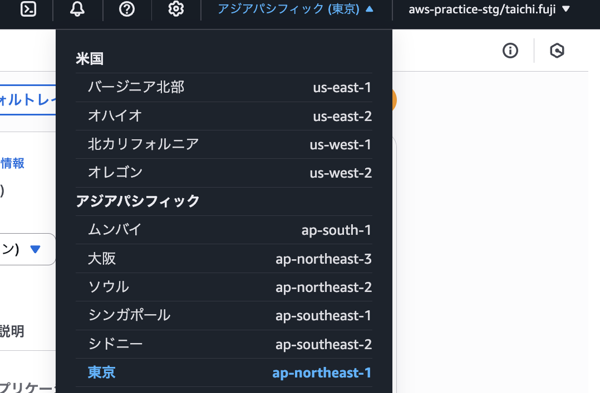

以降のAWSリソースは特に記載がない限り東京リージョンで作成してください。

# AWS CLIを使えるようにする
AWS環境構築でAWS CLIを使う場面があるので設定します。

## AWS CLI用のIAMユーザー作成
以下の設定でAWS CLI用のIAMユーザーを作成しましょう。

- ユーザー名：aws-practice-terraform-stg
- AWS マネジメントコンソールへのユーザーアクセスを提供する：チェックなし
- 許可ポリシー：AdministratorAccess


ユーザー名が`aws-practice-terraform-stg`なのは、これから構築するAWS構成をTerraform管理するときにも使うユーザーだからです。マネジメントコンソールへのアクセスはセキュリティのために提供しません。さまざまなAWSリソースを扱うので`AdministratorAccess`権限を設定します。

## IAMユーザーのアクセスキー作成
自分のPCからAWSリソースへアクセスするためのアクセスキーを作成します。


ユースケースにコマンドラインインターフェースを選択し、アクセスキーのcsvファイルをダウンロードして完了をしましょう。csvファイルはIAMユーザーを使うために必要なので保管してください。

:::message
多要素認証は設定しません。設定するとAWS CLIやTerraformで数分ごとに多要素認証を求められて面倒だからです。マネジメントコンソールへのアクセスができないユーザーなので、セキュリティリスクもアクセスできるユーザーよりは低いです
:::

## AWS CLIの設定
### ACS CLIのインストール
AWS CLIのインストールは[公式ドキュメント](https://docs.aws.amazon.com/ja_jp/cli/latest/userguide/getting-started-install.html)の手順でも良いのですが、homebrewを使えば以下のコマンドで一発です。

```bash
brew install awscli
```

インストールが成功すれば以下のコマンドが実行できます。

```bash
aws --version

aws-cli/2.24.27 Python/3.12.9 Darwin/24.4.0 source/arm64
```

バージョンアップやアンインストールもhomebrewで簡単にできます。

### AWS CLI設定ファイルの作成
`aws configure`コマンドで対話形式でAWS CLIの設定ファイルを作成できます。以下の設定をしましょう。

```bash
aws configure

AWS Access Key ID [None]: アクセスキーのcsvファイルのAccess key ID
AWS Secret Access Key [None]: アクセスキーのcsvファイルのSecret access key
Default region name [None]: ap-northeast-1
Default output format [None]: json
```

設定が完了すると`~/.aws/credentials`と`~/.aws/config`の2つのファイルが作成されます。

### `~/.aws/credentials`の更新
`credentials`ファイルを開きます。

```bash
code ~/.aws/credentials
```

:::message
私は[codeコマンドでVSCodeが開く設定](https://design-levelup.com/vscode/vscode/)をしています
:::

```bash:credentials
[default]
aws_access_key_id = アクセスキーのcsvファイルのAccess key ID
aws_secret_access_key = アクセスキーのcsvファイルのSecret access key
```

`credentials`はIAMユーザーのアクセスキーを管理するファイルです。AWS CLIで使いたいユーザーやアクセスキーが増えたら`credentials`に追記します。

`[default]`はデフォルトで使われるユーザーなので、わかりやすく`[aws-practice-terraform-stg]`に更新しましょう。

### `~/.aws/config`の更新
`config`ファイルを開きます。

```bash
code ~/.aws/config
```

```bash:config
[default]
region = ap-northeast-1
output = json
```

`config`にはリージョンとAWS CLIの出力形式が管理されています。`config`は`[default]`を`[profile aws-practice-terraform-stg]`に更新しましょう。これで`credentials`の`aws-practice-terraform-stg`と`config`の`[profile aws-practice-terraform-stg]`がひも付きます。

### AWS CLIの動作確認
`AWS_PROFILE`という環境変数に`credentials`で設定したユーザー名を設定すると、AWS CLIが`credentials`と`config`の内容を読み込みます。

```bash
export AWS_PROFILE=aws-practice-terraform-stg
```

`AWS_PROFILE`の設定ができたら以下のコマンドでAWS CLIが使えるか試しましょう。

```bash
aws iam list-users --output table

-------------------------------------------------------------------------------
|                                  ListUsers                                  |
+-----------------------------------------------------------------------------+
||                                   Users                                   ||
|+------------+--------------------------------------------------------------+|
||  Arn       |  arn:aws:iam::{ユーザーID}:user/aws-practice-terraform-stg　　 ||
||  CreateDate|  2025-05-06T02:00:18+00:00                                   ||
||  Path      |  /                                                           ||
||  UserId    |  ユーザーID                                                　　||
||  UserName  |  aws-practice-terraform-stg                                  ||
|+------------+--------------------------------------------------------------+|
```

# VPC作成
AWSのプライベートなネットワークであるVPCを作成します。設定内容は以下のとおり。


IPv4 CIDRは`10.0.0.0/16`がネットワーク部が最も小さくなる設定値です。ネットワーク部を最小にすることで、VPC内により多くのIPアドレスを作成できます。

複数のVPCが必要な場合や小規模なサービスの場合は、ネットワーク部を大きく設定します。ネットワーク部を大きくするとIPアドレス空間が小さくなって攻撃対象領域が減ります。

# サブネット作成
作成したVPC内に4つのサブネットを作成します。

- public-subnet-1a-stg
  - アベイラビリティゾーン：ap-northeast-1a
  - IPv4 VPC CIDRブロック：10.0.0.0/18
- public-subnet-1c-stg
  - アベイラビリティゾーン：ap-northeast-1c
  - IPv4 VPC CIDRブロック：10.0.64.0/18
- private-subnet-1a-stg
  - アベイラビリティゾーン：ap-northeast-1a
  - IPv4 VPC CIDRブロック：10.0.128.0/18
- private-subnet-1c-stg
  - アベイラビリティゾーン：ap-northeast-1c
  - IPv4 VPC CIDRブロック：10.0.192.0/18


VPCの`10.0.0.0/16`を4つのサブネットに分割する計算は以下のとおり。

1. VPC内のIPアドレス数は`2^16=65536`個
2. 4サブネットに分割するので1サブネットのIPアドレス数は`65536/4=16384`
3. 1サブネットのIPアドレス数が`16384=2^14`なので、サブネットのCIDRは/18
4. VPCのCIDR/16とサブネットの/18の差分は2。2ビットでの2進数は00、01、10、11
5. 第3オクテットの1、2ビット目が00、01、10、11なので10進数に直すと0、64、128、256

# インターネットゲートウェイ作成
パブリックサブネットのAWSリソースをインターネットにつなげるためにはインターネットゲートウェイが必要です。`aws-practice-igw-stg`という名前タグで作成してください。

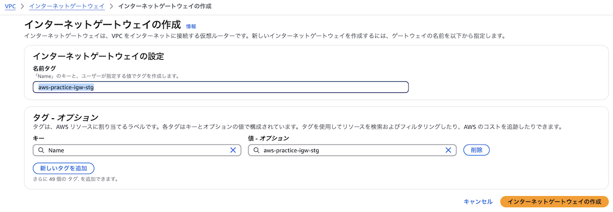

作成したインターネットゲートウェイをVPCにアタッチしましょう。

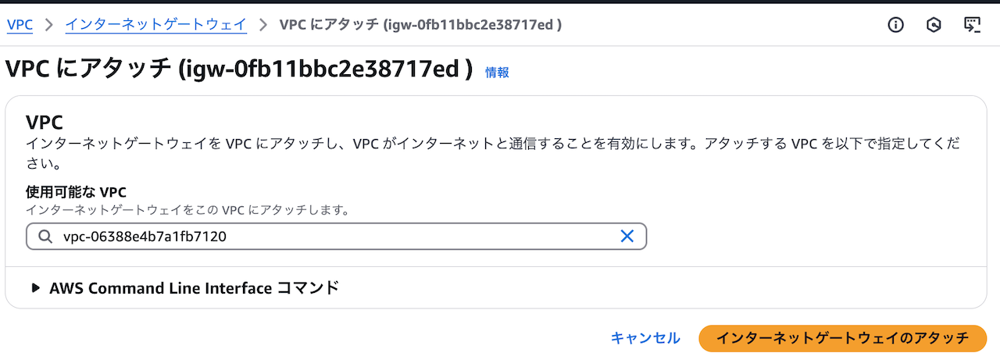
# ルートテーブル作成
## プライベートサブネット用
以下設定でルートテーブルを作成します。

- 名前：aws-practice-rtb-private-stg
- VPC：aws-practice-stg

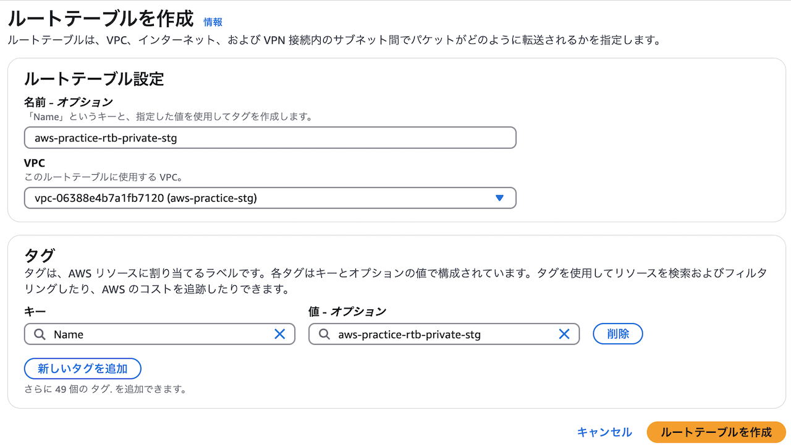

作成したルートテーブルをプライベートサブネットに関連付けましょう。

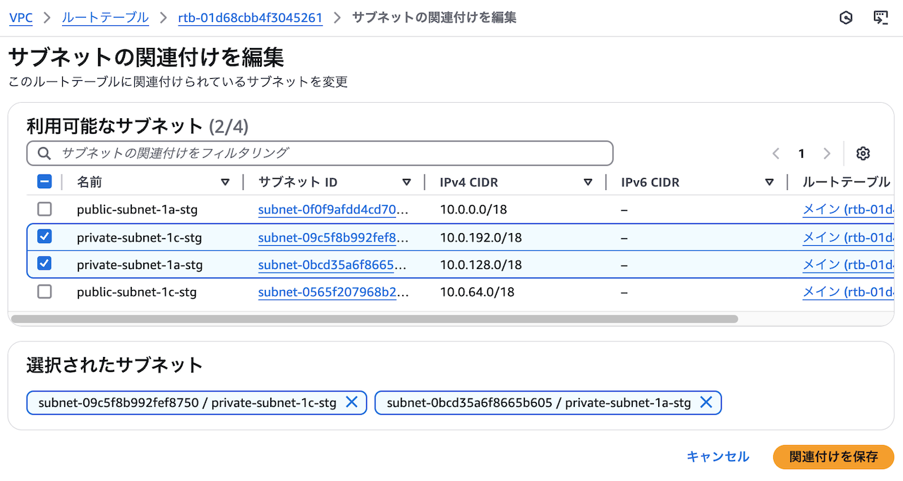

作成したプライベートサブネット用ルートテーブルをメインルートテーブルにしておくと、サブネット作成時のデフォルトルートテーブルになります。サブネットとルートテーブル関連付けを忘れても通信がインターネットに向かないので安全です。

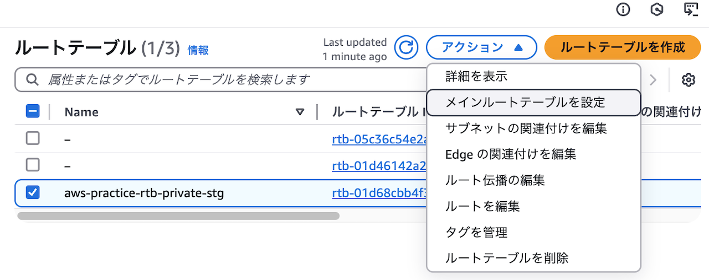

## パブリックサブネット用
以下設定でルートテーブルを作成します。

- 名前：aws-practice-rtb-public-stg
- VPC：aws-practice-stg

そして`0.0.0.0/0`インターネットゲートウェイに向けたルートを追加します。

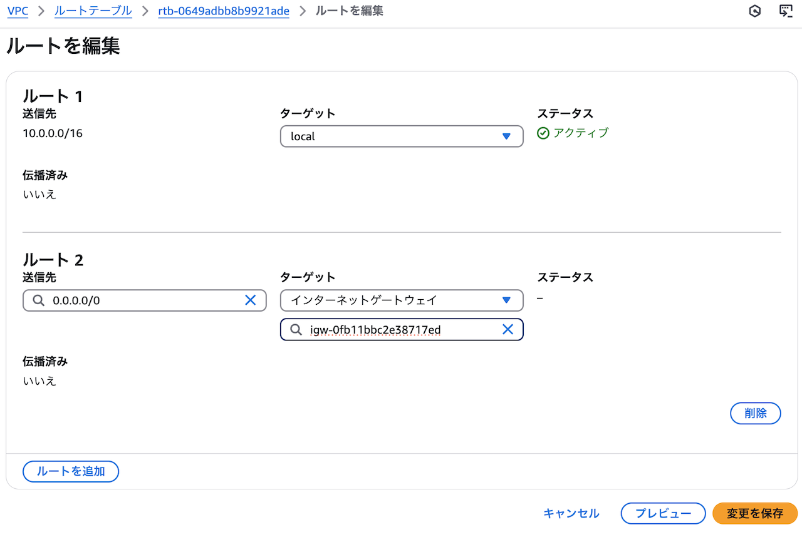

作成したルートテーブルをパブリックサブネットに関連付けましょう。

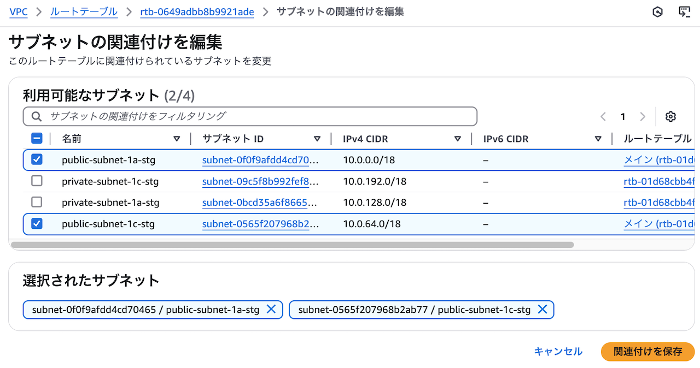

# RDS作成
RDSに必要なAWSリソースを作成します。
## RDS用セキュリティグループ
以下設定でRDS用のセキュリティグループを作成します。

- セキュリティグループ名：aws-practice-db-stg
- 説明：Managed by Terraform(今後Terraformで設定する値をあらかじめ登録)
- VPC：aws-practice-stg
- インバウンドルール：なし
- アウトバウンドルール：すべてのトラフィックで0.0.0.0/0(デフォルト設定)

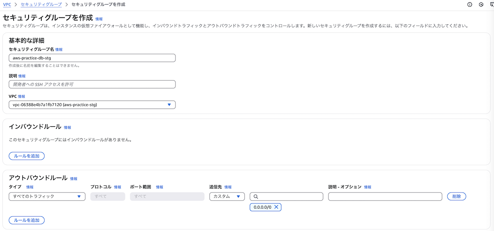

RDSはAPIサーバーからの通信のみを許可します。ですが、現時点でAPIサーバーはないのでインバウンドルールを一旦なしで設定します。

## DBサブネットグループ
複数AZにまたがるサブネットをDBサブネットグループとして指定することで、DBが障害時にフェイルオーバーするので冗長性が高まります。作成するDBサブネットグループは以下です。

- 名前：aws-practice-db-subnet-group-stg
- 説明：Managed by Terraform
- VPC：aws-practice-stg
- サブネット：private-subnet-1a-stg、private-subnet-1c-stg

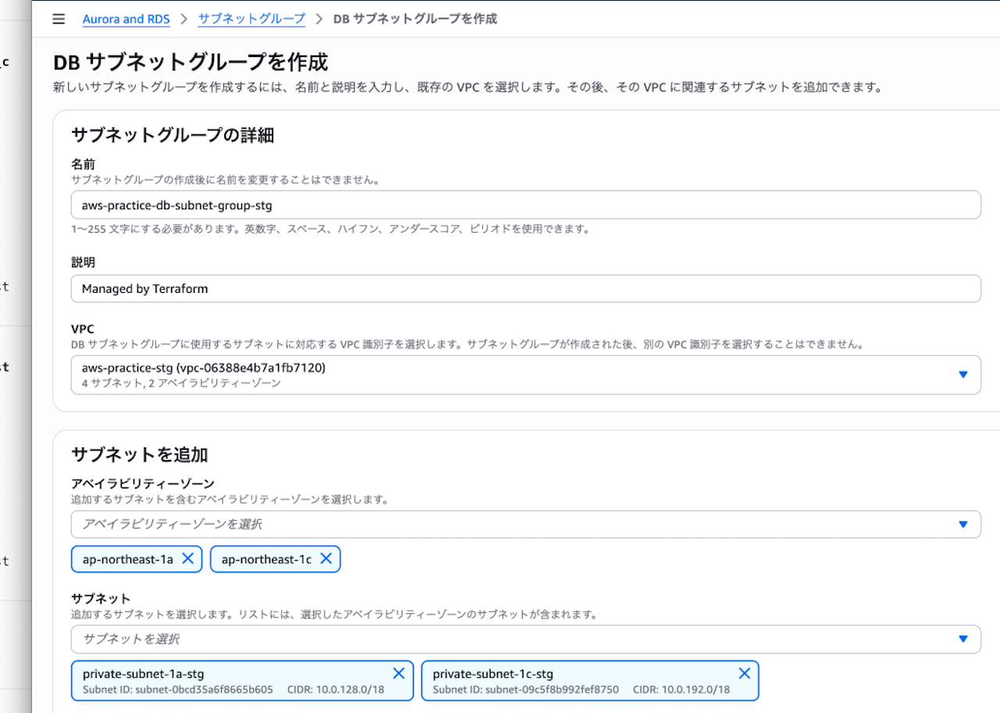

DBは外部からアクセスされたくないので、プライベートサブネットを指定します。

### セキュリティグループ設計のベストプラクティス
セキュリティグループ設計は1サービス1セキュリティグループがベストプラクティスです。1サービス1セキュリティグループはシンプルでわかりやすく、どこからの通信を許可しているのかひと目でわかります。

たとえば、

- WebサーバーEC2とWebサーバーEC2用セキュリティグループ
- RDSとRDS用セキュリティグループ

があるとします。この状態でRDS用セキュリティグループのインバウンドルールにWebサーバー用EC2セキュリティグループのみが設定されていれば、RDSはWebサーバーからの通信のみ許可していることがすぐ理解できます。

1つのサービスに1つのセキュリティグループがわかりやすく運用しやすい設計です。

### 作成


# NATゲートウェイについて理解する
## 役割と使用例
NATゲートウェイは**サブネットから外への通信のみ許可**します。許可された通信のresponseも許可されます。ですがインターネットゲートウェイと違い、**外からサブネットへの通信は許可されません**。

なのでプライベートサブネットのAWSリソースのセキュリティを保ちつつ、サブネット外と通信したいときに使います。たとえばプライベートサブネットのECSタスクがNAT経由でECRにアクセスするといった使い方ができます。

## コスト対策
NATゲートウェイは[1時間あたり$0.062、処理データ1GBあたり$0.062](https://aws.amazon.com/jp/vpc/pricing/)のコストがかかります。1ドル150円で計算すると、つけっぱなしで処理データが0でも月7000円弱の費用です。

個人利用で月7000円はキツいので、本記事ではコストが10分の1ほどになるNATインスタンスを使います。他のコスト対策として、難易度は上がりますがVPC Endpointを使う方法もあります。

:::message
実務ではフルマネージドなNATゲートウェイを使うことがほとんどです
:::

## NATゲートウェイの設定例
実務で扱えるようになるため、NATゲートウェイの設定を理解しましょう。本記事のAWS構成でNATゲートウェイを使う場合、以下の設定になります。

- 名前：aws-practice-nat-1a
- サブネット：public-subnet-1a-stg
- 接続タイプ：パブリック
- Elastic IP割り当てID：あり
- タグ：Name aws-practice-nat-1a(自動入力される)

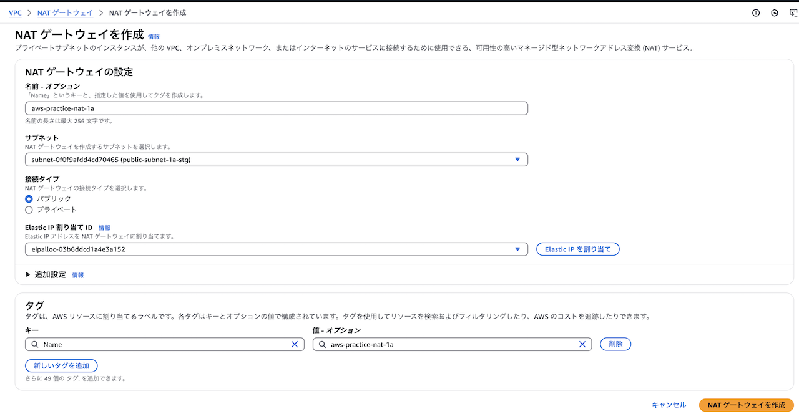

プライベートサブネットのAWSリソースのインターネット接続が目的の場合、NATゲートウェイはパブリックサブネットに配置します。通信がプライベートサブネット → NAT → インターネットの順に流れるためです。
またElastic IPの割り当ても必須です。インターネット通信のためにはパブリックなIPアドレスが必要だからです。

:::message
設定の理解が目的なので実際にNATゲートウェイを作成する必要はありません
:::

## AWSのベストプラクティスは複数AZでの冗長化推奨
NATゲートウェイはAZ内で冗長化されているので、使っているNATで障害が起きてもシステムを維持できます。ただAZ障害が起こるとプライベートサブネットのAWSリソースは全てNATを介した通信ができなくなります。そのためAWSのベストプラクティスとして複数AZでのNAT冗長化が推奨されています。

# NATインスタンス作成
## セキュリティグループ作成
NATインスタンス用のセキュリティグループを作成します。以下のようにプライベートサブネットからのインバウンド通信を許可します。

- セキュリティグループ名：aws-practice-nat-stg
- 説明：Managed by Terraform
- VPC：aws-practice-stg
- インバウンドルール1つめ
  - タイプ：すべてのトラフィック
  - ソース：カスタム 10.0.128.0/18(private-subnet-1a-stgのIP)
- インバウンドルール2つめ
  - タイプ：すべてのトラフィック
  - ソース：カスタム 10.0.192.0/18(private-subnet-1c-stgのIP)
- アウトバウンドルール(デフォルト)
  - タイプ：すべてのトラフィック
  - 送信先：カスタム 0.0.0.0/0

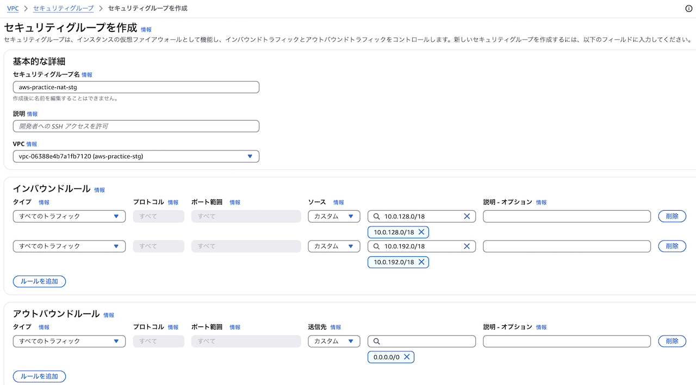

## NATインスタンスにSession ManagerでアクセスするためのIAMロールを設定
`AmazonSSMManagedInstanceCore`ポリシーを持ったIAMロールを作成します。このロールはあとでNATインスタンスに設定します。

`AmazonSSMManagedInstanceCore`ポリシーを持ったIAMロールが必要な理由はNATインスタンスにSession Managerで接続するのに必要だからです。IAMロールの設定内容は以下のとおり。

- 信頼されたエンティティタイプ：AWSのサービス
- サービスまたはユースケース：EC2
- 許可ポリシー：AmazonSSMManagedInstanceCore
- ロール名：aws-practice-nat-stg

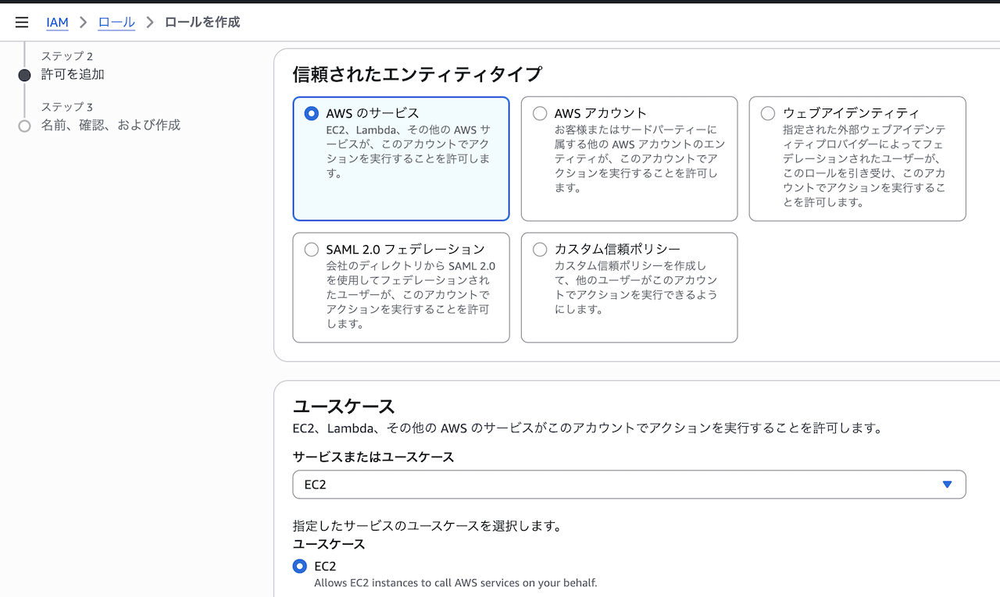

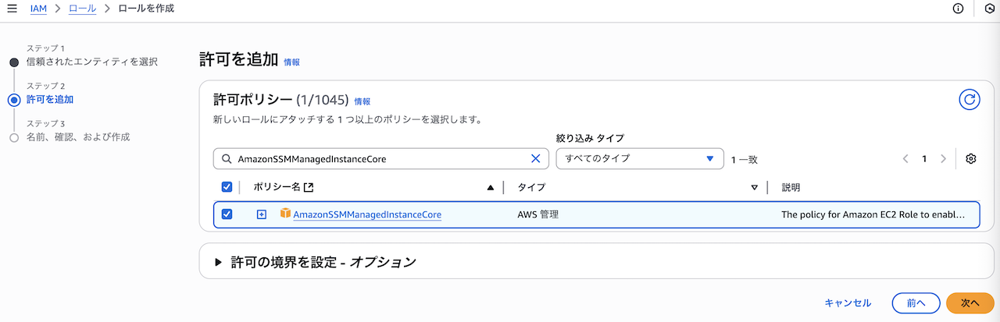

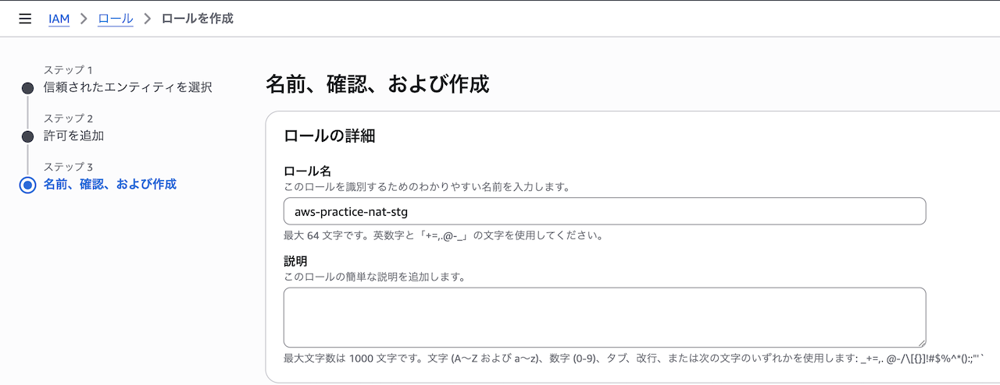

:::message
NATインスタンスにSSH接続することも可能です。ですが22番ポート開放とSSHキーが不要という点でSession Managerの方がセキュアです
:::

## EC2インタンス作成
NATインスタンスとして使うEC2インスタンスを以下設定で作成します。

- 名前：aws-practice-nat-1a-stg
- AMI：Amazon Linux 2023 AMI
- アーキテクチャ：64ビット(x86)
- インスタンスタイプ：t2.micro
- VPC：aws-practice-stg
- サブネット：public-subnet-1a-stg
- パブリックIPの自動割り当て：有効化
- セキュリティグループ：aws-practice-nat-stg
- IAMインスタンスプロフィール：aws-practice-nat-stg

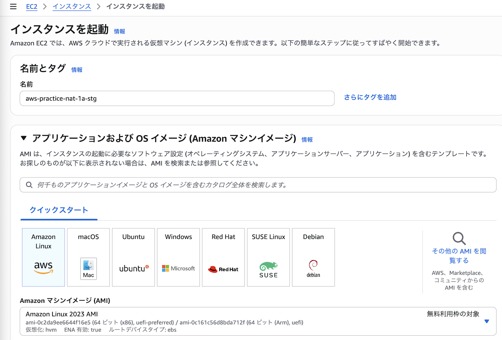

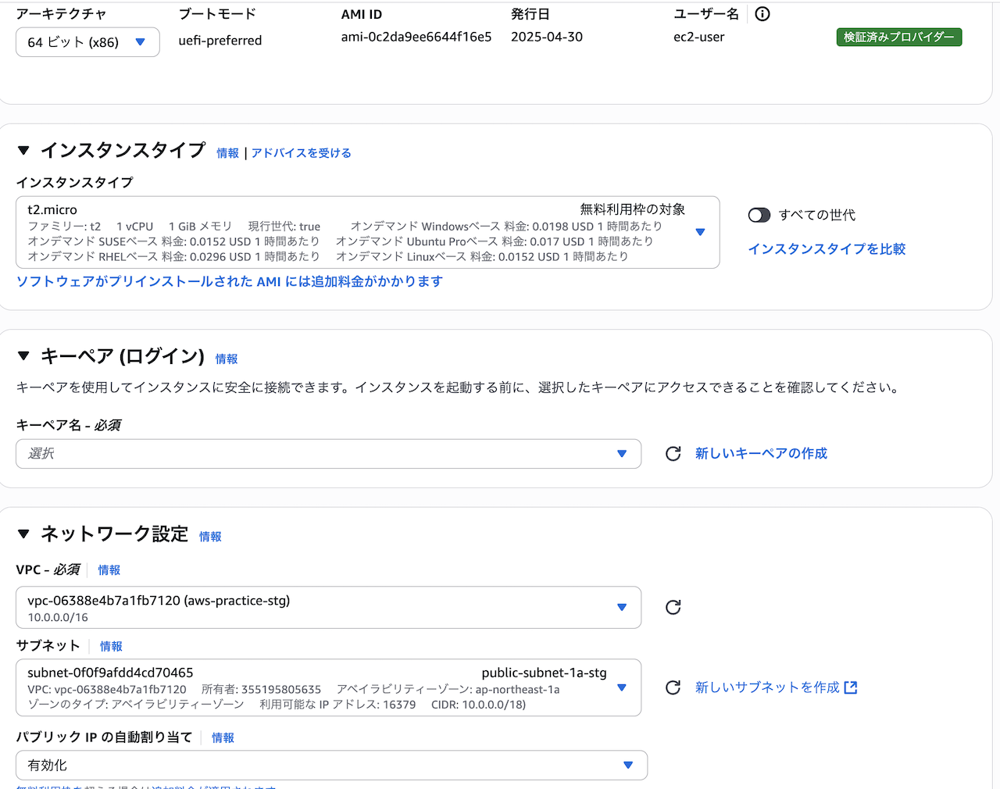

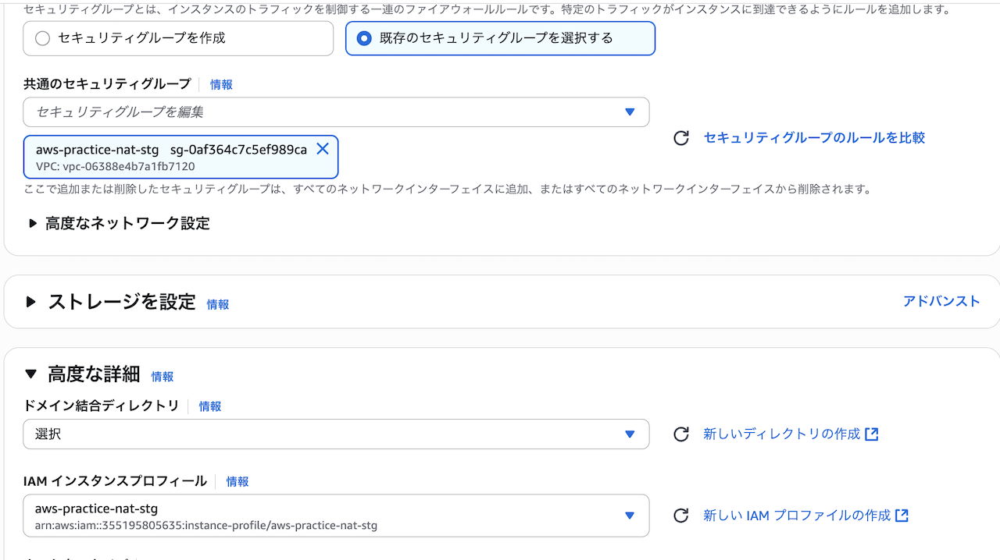

IAMインスタンスプロフィールでSession ManagerでアクセスするためのIAMロールを使っています。EC2インスタンスに直接IAMロールは紐づけられません。代わりにIAMロールが入ったIAMインスタンスプロフィールを紐づけます。

:::message
IAMインスタンスプロフィールはマネジメントコンソールでEC2用のIAMロール作成時に自動生成されます
:::

また未使用時にNATインスタンスを停止すればコスト削減ができます。


そして`0.0.0.0/0`をNATインスタンスに向けたルートを追加します。


## Session Managerによる接続確認

(続きは随時更新します)