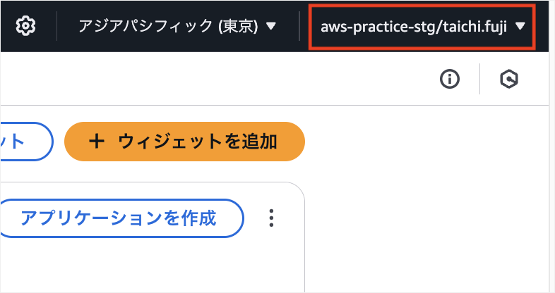

<title>実務レベルのAWS Webアプリ構築ハンズオン</title>


こんにちは、フリーランスエンジニアのたいち（[@taichi_hack_we](https://x.com/taichi_hack_we)）です。
今回は前回の記事↓で作成したKotlin、Spring BootバックエンドAPIを使って上記の実務レベルAWS構成でWebアプリを構築していきます。

https://zenn.dev/taichi_hack_we/articles/84c623ebee9e86

# 検証環境、本番環境アカウントを用意して1ユーザーアカウントでログインできるようにする
下記記事にそって、1つのIdentity Centerユーザーアカウントで検証環境と本番環境それぞれのAWSアカウントにログインできるようにしましょう。検証、本番アカウントを分ける理由は全環境を1つのアカウントで構築すると各環境のAWSリソースが混在して管理が面倒だからです。

また環境ごとにユーザID、パスワード、多要素認証を用意するのが手間なので、1ユーザアカウントで各環境のAWSアカウントにログインできるようにします。

https://techblog.ap-com.co.jp/entry/2024/04/11/090357

以下の内容で設定してください。

- Identity Centerユーザー
  - ユーザー名：任意の値 ex.taichi
  - 多要素認証：ON
- AWS Organizationsの検証環境用AWSアカウント
  - AWSアカウント名：aws-practice-stg
  - IAMロール名：OrganizationAccountAccessRole(デフォルトのまま)
- AWS Organizationsの本番環境用AWSアカウント
  - AWSアカウント名：aws-practice-prd
  - IAMロール名：OrganizationAccountAccessRole(デフォルトのまま)
- AWS Organizationsの組織構造：Root > aws-practice > aws-practice-prdとaws-practice-stg
- Identity Centerの検証環境用許可セット
  - ポリシー：AdministratorAccess
  - 許可セット名：aws-practice-stg
- Identity Centerの本番環境用許可セット
  - ポリシー：AdministratorAccess
  - 許可セット名：aws-practice-prd
- Identity Centerの検証環境用AWSアカウントへのユーザー、許可セット割り当て
  - ユーザー：Identity Centerで作成したユーザー ex.taichi
  - 許可セット：aws-practice-stg
- Identity Centerの本番環境用AWSアカウントへのユーザー、許可セット割り当て
  - ユーザー：Identity Centerで作成したユーザー ex.taichi
  - 許可セット：aws-practice-prd

> Tips AWSリソースに付ける環境名はsuffixで本番：`-prd`、検証：`-stg`と統一すると管理しやすいです

検証、本番の許可セットポリシーが同じ`AdministratorAccess`なのに検証、本番で許可セットをそれぞれ用意している理由は、ログイン後のAWSマネジメントコンソールで許可セット名が表示されるためです。`aws-practice-stg`のように許可セット名に環境名が含まれていれば、自分が今いる環境がひと目でわかります。



上記の設定が完了すると以下手順で各環境にログインできるようになります。

1. `https://{固有のID}.awsapps.com/start/#/?tab=accounts`でAWS access portalへアクセス
2. ユーザID、パスワードでログイン
3. AWS access portalから好きな環境へ入る


環境を切り替えたいときは再度AWS access portalから好きな環境へ入ります。

# AWS CLIを使えるようにする
AWS環境構築でAWS CLIを使う場面があるので設定します。

## AWS CLI用のIAMユーザー作成
以下の設定でAWS CLI用のIAMユーザーを作成しましょう。

- ユーザー名：aws-practice-terraform-stg
- AWS マネジメントコンソールへのユーザーアクセスを提供する：チェックなし
- 許可ポリシー：AdministratorAccess


ユーザー名が`aws-practice-terraform-stg`なのは、これから構築するAWS構成をTerraform管理するときにも使うユーザーだからです。マネジメントコンソールへのアクセスはセキュリティのために提供しません。さまざまなAWSリソースを扱うので`AdministratorAccess`権限を設定します。

## IAMユーザーのアクセスキー作成
自分のPCからAWSリソースへアクセスするためのアクセスキーを作成します。


ユースケースにコマンドラインインターフェースを選択し、アクセスキーのcsvファイルをダウンロードして完了をしましょう。csvファイルはIAMユーザーを使うために必要なので保管してください。

> Tips：多要素認証は設定しません。設定するとAWS CLIやTerraformで数分ごとに多要素認証を求められて面倒だからです。マネジメントコンソールへのアクセスができないユーザーなので、セキュリティリスクもアクセスできるユーザーよりは低いです

## AWS CLIの設定
### ACS CLIのインストール
AWS CLIのインストールは[公式ドキュメント](https://docs.aws.amazon.com/ja_jp/cli/latest/userguide/getting-started-install.html)の手順でも良いのですが、homebrewを使えば以下のコマンドで一発です。

```bash
brew install awscli
```

インストールが成功すれば以下のコマンドが実行できます。

```bash
aws --version

aws-cli/2.24.27 Python/3.12.9 Darwin/24.4.0 source/arm64
```

バージョンアップやアンインストールもhomebrewで簡単にできます。

### AWS CLI設定ファイルの作成
`aws configure`コマンドで対話形式でAWS CLIの設定ファイルを作成できます。以下の設定をしましょう。

```bash
aws configure

AWS Access Key ID [None]: アクセスキーのcsvファイルのAccess key ID
AWS Secret Access Key [None]: アクセスキーのcsvファイルのSecret access key
Default region name [None]: ap-northeast-1
Default output format [None]: json
```

設定が完了すると`~/.aws/credentials`と`~/.aws/config`の2つのファイルが作成されます。

### `~/.aws/credentials`の更新
`credentials`ファイルを開きます。

```bash
code ~/.aws/credentials
```

> Tips：私は[codeコマンドでVSCodeが開く設定](https://design-levelup.com/vscode/vscode/)をしています

```bash:credentials
[default]
aws_access_key_id = アクセスキーのcsvファイルのAccess key ID
aws_secret_access_key = アクセスキーのcsvファイルのSecret access key
```

`credentials`はIAMユーザーのアクセスキーを管理するファイルです。AWS CLIで使いたいユーザーやアクセスキーが増えたら`credentials`に追記します。

`[default]`はデフォルトで使われるユーザーなので、わかりやすく`[aws-practice-terraform-stg]`に更新しましょう。

### `~/.aws/config`の更新
`config`ファイルを開きます。

```bash
code ~/.aws/config
```

```bash:config
[default]
region = ap-northeast-1
output = json
```

`config`にはリージョンとAWS CLIの出力形式が管理されています。`config`は`[default]`を`[profile aws-practice-terraform-stg]`に更新しましょう。これで`credentials`の`aws-practice-terraform-stg`と`config`の`[profile aws-practice-terraform-stg]`がひも付きます。

### AWS CLIの動作確認
`AWS_PROFILE`という環境変数に`credentials`で設定したユーザー名を設定すると、AWS CLIが`credentials`と`config`の内容を読み込みます。

```bash
export export AWS_PROFILE=aws-practice-terraform-stg
```

`AWS_PROFILE`の設定ができたら以下のコマンドでAWS CLIが使えるか試しましょう。

```bash
aws iam list-users --output table

-------------------------------------------------------------------------------
|                                  ListUsers                                  |
+-----------------------------------------------------------------------------+
||                                   Users                                   ||
|+------------+--------------------------------------------------------------+|
||  Arn       |  arn:aws:iam::{ユーザーID}:user/aws-practice-terraform-stg　　 ||
||  CreateDate|  2025-05-06T02:00:18+00:00                                   ||
||  Path      |  /                                                           ||
||  UserId    |  ユーザーID                                                　　||
||  UserName  |  aws-practice-terraform-stg                                  ||
|+------------+--------------------------------------------------------------+|
```

# VPC作成
AWSのプライベートなネットワークであるVPCを作成します。設定内容は以下のとおり。


IPv4 CIDRは`10.0.0.0/16`がネットワーク部が最も小さくなる設定値です。ネットワーク部を最小にすることで、VPC内により多くのIPアドレスを作成できます。

複数のVPCが必要な場合や小規模なサービスの場合は、ネットワーク部を大きく設定します。ネットワーク部を大きくするとIPアドレス空間が小さくなって攻撃対象領域が減ります。

# サブネット作成
作成したVPC内に4つのサブネットを作成します。

- public-subnet-1a-stg
  - アベイラビリティゾーン：ap-northeast-1a
  - IPv4 VPC CIDRブロック：10.0.0.0/18
- public-subnet-1c-stg
  - アベイラビリティゾーン：ap-northeast-1c
  - IPv4 VPC CIDRブロック：10.0.64.0/18
- private-subnet-1a-stg
  - アベイラビリティゾーン：ap-northeast-1a
  - IPv4 VPC CIDRブロック：10.0.128.0/18
- private-subnet-1c-stg
  - アベイラビリティゾーン：ap-northeast-1c
  - IPv4 VPC CIDRブロック：10.0.192.0/18


VPCの`10.0.0.0/16`を4つのサブネットに分割する計算は以下のとおり。

1. VPC内のIPアドレス数は`2^16=65536`個
2. 4サブネットに分割するので1サブネットのIPアドレス数は`65536/4=16384`
3. 1サブネットのIPアドレス数が`16384=2^14`なので、サブネットのCIDRは/18
4. VPCのCIDR/16とサブネットの/18の差分は2。2ビットでの2進数は00、01、10、11
5. 第3オクテットの1、2ビット目が00、01、10、11なので10進数に直すと0、64、128、256

(続きは随時更新します)