# 実務レベルのKotlin、Spring BootによるAPI環境構築とDockerコンテナ化

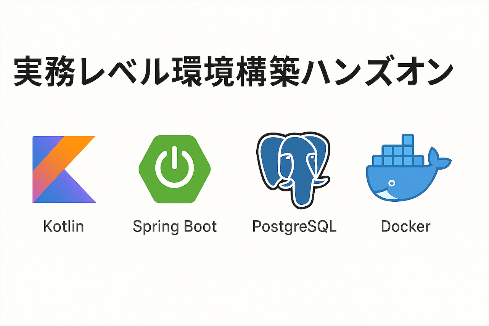

エンジニア歴7年目フリーランスエンジニアのたいち([@taichi_hack_we](https://x.com/taichi_hack_we))です。

本記事のゴールは、

- Kotlin
- Spring Boot
- PostgreSQL
- IntelliJ IDEA

で、バックエンドAPIの環境構築をしてDockerコンテナ化することです。環境変数や静的解析、脆弱性チェックなど実務レベルの環境構築手順がわかります。以下の記事ではこのバックエンドAPIを使って実務レベルのAWS構成を構築します。

(後日公開予定)

バックエンドのGithubリポジトリは以下です。

https://github.com/taichi-web-engineer/aws-practice

実務レベルのAWS Webアプリ環境構築が目的なので、アプリの機能は最低限しか実装しません。機能はKotlin、Spring BootでDBからデータを取得して返すAPIを用意するのみです。

IntelliJやGit、Linuxコマンドなどの基本は調べればすぐわかるので、説明は割愛します。

## Gitでaws-practiceリポジトリ作成
[Github](https://github.com/)でaws-practiceという名前でリポジトリを作成します。


リポジトリを作成したら`git clone`でローカルリポジトリを作成しましょう。
```bash
git clone git@github.com:taichi-web-engineer/aws-practice.git
```

## グローバルなgitignoreで不要ファイルのcommitを防ぐ
gitでcommitをするとOSの一時ファイルなど、不要なファイルがリポジトリに入ることがあります。

不要ファイルのcommitを防ぐために`~/.config/git/ignore`を作成しましょう。`ignore`に書いたファイルはローカルの全リポジトリでcommit対象外になります。

私のPCはMacOSなので、Githubが出しているMacOS用のgitignoreを使っています。

https://github.com/github/gitignore/blob/main/Global/macOS.gitignore

環境変数の管理は[direnv](https://direnv.net/)というツールを使います（詳細は後ほど解説）。
direnvの環境変数設定ファイルである`.envrc`を`ignore`に追記した完成形が以下です。

```
# General
.DS_Store
.AppleDouble
.LSOverride
Icon[]

# Thumbnails
._*

# Files that might appear in the root of a volume
.DocumentRevisions-V100
.fseventsd
.Spotlight-V100
.TemporaryItems
.Trashes
.VolumeIcon.icns
.com.apple.timemachine.donotpresent

# Directories potentially created on remote AFP share
.AppleDB
.AppleDesktop
Network Trash Folder
Temporary Items
.apdisk

.envrc
```

## aws-practiceリポジトリの.gitignoreを作成
aws-practiceリポジトリ専用の`.gitignore`を作成します。
ChatGPT o3の検索モードで以下の質問をして`.gitignore`の内容を確認しました。

```
kotlin、spring bootのwebアプリ用の.gitignoreのベストプラクティスを教えて
```

https://chatgpt.com/share/680cc02e-36bc-8009-a7c5-9cdb609d75dd

o3の回答をもとに作成したものが以下です。グローバルなgitignoreで設定しているもの、不要なものは削除しています。

https://github.com/taichi-web-engineer/aws-practice/blob/main/.gitignore

## DB、AWS関連モジュールの取得
私のaws-practiceのGithubリポジトリから`aws-practice/ops`、`aws-practice/Makefile`を取得して自身のaws-practiceの同じパスに配置してください。DB、AWS環境の構築時に使います。

https://github.com/taichi-web-engineer/aws-practice

## Kotlin、Spring Bootプロジェクトの作成
[Spring Initializr](https://start.spring.io/#!type=gradle-project-kotlin&language=kotlin&platformVersion=3.4.5&packaging=jar&jvmVersion=21&groupId=com.awsPracticeTaichi&artifactId=api&name=api&description=API%20project%20with%20Spring%20Boot&packageName=com.awsPracticeTaichi.api&dependencies=web,data-jpa,postgresql)で、以下設定でGENERATEボタンをクリックし、Kotlin、Spring Bootプロジェクトをダウンロードしてaws-practiceのルートディレクトリに<span id="spring_initializr_setting">配置</span>します。

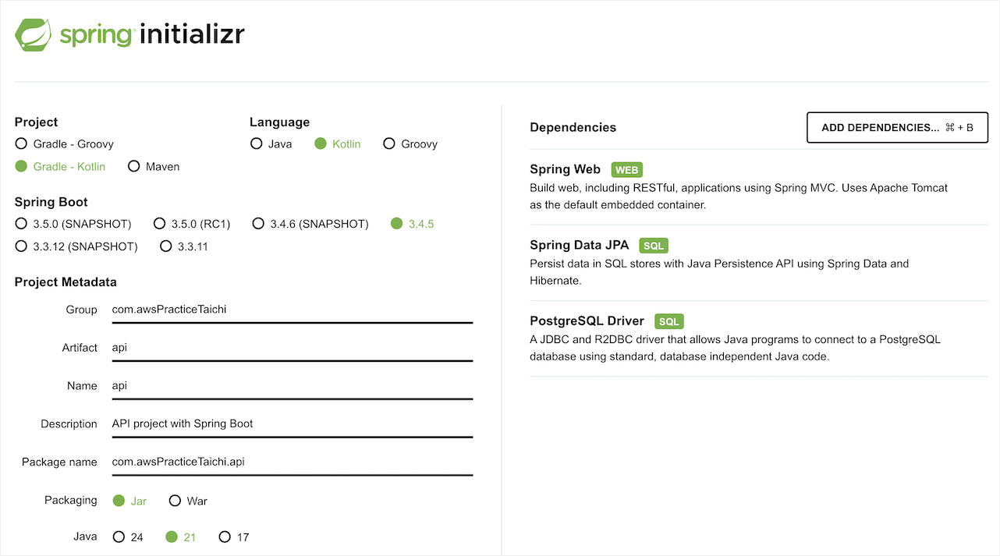

`Gradle - Kotlin`を選ぶ理由は私が他のGroovyやMavenを使ったことがないためです。実務でもGradleがよく使われている印象です。

Spring Boot、Javaのバージョンは最新のLTS(安定)バージョンを選びます。

Project Metadataの概要は以下のとおりです。

- Group：ドメインを逆にしたものを設定する。パッケージ名などで使われる
- Artifact：プロジェクト自体のディレクトリ名などで使われる

GroupはAWSで取得するドメインをもとに設定します。私は`aws-practice-taichi.com`というドメインを取得するので、`com.awsPracticeTaichi`としました。パッケージ名に「-」は使えないのでキャメルケースにしています。

DependenciesにはAPI、DB設定に必要なツールを追加しました。

## Kotlin、Spring Bootアプリを最新バージョンにする
Kotlin、Spring Bootなど、各ライブラリのバージョンは`api/build.gradle.kts`で以下のように定義されています。
```kotlin
plugins {
	kotlin("jvm") version "1.9.25"
	kotlin("plugin.spring") version "1.9.25"
	id("org.springframework.boot") version "3.4.5"
	id("io.spring.dependency-management") version "1.1.7"
	kotlin("plugin.jpa") version "1.9.25"
}

group = "com.awsPracticeTaichi"
version = "0.0.1-SNAPSHOT"

java {
	toolchain {
		languageVersion = JavaLanguageVersion.of(21)
	}
}

repositories {
	mavenCentral()
}

dependencies {
	implementation("org.springframework.boot:spring-boot-starter-data-jpa")
	implementation("org.springframework.boot:spring-boot-starter-web")
	implementation("com.fasterxml.jackson.module:jackson-module-kotlin")
	implementation("org.jetbrains.kotlin:kotlin-reflect")
	runtimeOnly("org.postgresql:postgresql")
	testImplementation("org.springframework.boot:spring-boot-starter-test")
	testImplementation("org.jetbrains.kotlin:kotlin-test-junit5")
	testRuntimeOnly("org.junit.platform:junit-platform-launcher")
}

kotlin {
	compilerOptions {
		freeCompilerArgs.addAll("-Xjsr305=strict")
	}
}

allOpen {
	annotation("jakarta.persistence.Entity")
	annotation("jakarta.persistence.MappedSuperclass")
	annotation("jakarta.persistence.Embeddable")
}

tasks.withType<Test> {
	useJUnitPlatform()
}
```

ライブラリのバージョンは最新のLTSを使いたいので、Gensparkのスーパーエージェントに以下のプロンプトで修正してもらいましょう。
```
以下のbuild.gradle.ktsの設定内容を最新のLTSバージョンに更新したいです

{build.gradle.ktsの全文をコピペ}
```

以下がAIとのやりとりの内容です。

https://www.genspark.ai/agents?id=7101cdc5-e583-4460-a838-3dcf928f6c5b

AIの回答を踏まえた<span id="latest_build_gradle_kts">`build.gradle.kts`の完成版</span>は以下です。

https://github.com/taichi-web-engineer/aws-practice/blob/main/api/build.gradle.kts

[detekt](https://detekt.dev/)という静的解析ツールを使いたいので、jvmのバージョン変更や関連ライブラリ追加をしています。(詳細は後ほど解説)

`build.gradle.kts`を完成版と同じ内容に更新したら「すべてのGradle プロジェクトを同期」ボタンで`build.gradle.kts`のライブラリやプラグインを反映できます。

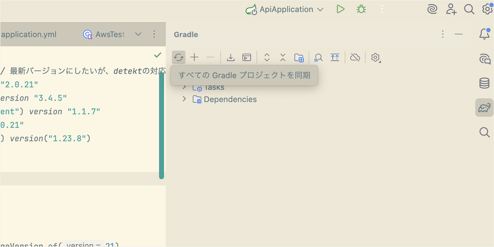

Gradle同期時に`The detekt plugin found some problems`という警告が出ますが、これはdetektの設定が未完了なためなので無視してOKです。

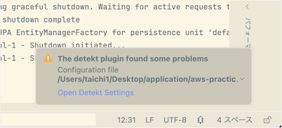

## Docker環境構築
Dockerを使うため、[Docker Desktop](https://www.docker.com/ja-jp/products/docker-desktop/)か[OrbStack](https://orbstack.dev/)をインストールします。Appleシリコン製のMacユーザーはOrbStackを圧倒的におすすめします。OrbStackはDocker Desktopと同じ機能で動作が軽くて速いからです。詳細は以下の記事を参照してください。

https://qiita.com/shota0616/items/5b5b74d72272627e0f5a

`docker help`コマンドが使えればDocker環境構築完了です。

```bash
docker help

Usage:  docker [OPTIONS] COMMAND

A self-sufficient runtime for containers

Common Commands:
  run         Create and run a new container from an image
  exec        Execute a command in a running container
  ps          List containers
  build       Build an image from a Dockerfile
  pull        Download an image from a registry
  ...
```

Docker Desktopを使っている方は以降のOrbStackをDocker Desktopに読み替えてください。

## DB環境構築
`ops/db-migrator/README.md`をもとにDB環境構築をします。知り合いのエンジニアが作成したGoのDBマイグレーションツールが使いやすいので活用しています。

https://github.com/taichi-web-engineer/aws-practice/blob/main/ops/db-migrator/README.md

`README.md`に書いてあるとおり`brew install golang-migrate`で`golang-migrate`をインストールします。`golang-migrate`はDBマイグレーションツールで使います。あとは`ops/db-migrator`ディレクトリで以下コマンドを順に実行すればDBにテーブルが作成されます。

```bash
docker compose up -d
go run main.go
```

テーブルを作成したら以下コマンドでテーブルにデータを入れます。

```bash
make restore DB=aws_practice
```

`make restore`コマンドの実態は[ops/db-migrator/Makefile](https://github.com/taichi-web-engineer/aws-practice/blob/9824a750e1d08516d84459d495eaecc733cb1e6d/ops/db-migrator/Makefile#L32)で定義している以下です。

```makefile
# dumpファイルからseedデータを復元する。
# e.g.
# make restore DB=aws_practice
restore: .check-db
	docker compose exec -T db psql -U postgres -d $(DB) -c "DROP SCHEMA public CASCADE; CREATE SCHEMA public;"
	docker compose exec -T db psql -U postgres -d $(DB) < db/$(DB)/dump.sql
```

Makefileは複数のコマンドや変数を使ってコマンドを簡略化するコマンド集のようなものです。`make restore`コマンドの実態は引数のチェックをしたあと2つの`docker compose exec`コマンドでDBに`dump.sql`のseedデータを登録するコマンドというわけです。

データを入れたら、[TablePlus](https://tableplus.com/)などのDBクライアントツールで`aws_test`テーブルのテストデータを確認できればOKです。


DBのDockerコンテナはマウントによるデータ永続化をしていません。Dockerコンテナを停止するとテストデータは削除されます。

永続化をしない理由はDBマイグレーションでDB環境をすぐ復元できるためです。復元のためのテストデータは以下のディレクトリで管理しています。

https://github.com/taichi-web-engineer/aws-practice/tree/main/ops/db-migrator/db/aws_practice

DBを使うときは<span id="db_exec">以下手順</span>でDB環境を復元できます。

 1. Docker Desktop or OrbStackの起動
 2. ops/db-migratorへcd
 3. docker compose up -d
 4. go run main.go
 5. make restore DB=aws_practice

## direnvで環境変数の設定
DBのパスワードなど、Gitにコミットしたくないセキュアな情報は環境変数で管理しましょう。[direnv](https://direnv.net/)というディレクトリごとに環境変数を設定できるツールを使います。

https://zenn.dev/masuda1112/articles/2024-11-29-direnv

direnvをインストールしたら`api`ディレクトリに移動します。

```bash
cd api
```

環境変数を管理するファイルである`.envrc`を作成してエディタで開きます。私はVSCodeを使っています。

```bash
code .envrc
```

`.envrc`に以下を追記して保存しましょう。ローカルのDocker環境のDBなので、接続情報は`ops/db-migrator/compose.yaml`で設定しているデフォルト値を使います。

```
export DB_HOST=localhost
export DB_NAME=aws_practice
export DB_PASSWORD=postgres
export DB_PORT=5432
export DB_USERNAME=postgres
```

`.envrc`を保存したら`direnv allow .`を実行すれば`direnv`で環境変数を使う準備完了です。

## Spring BootアプリのDB接続設定
Spring BootアプリのDB接続情報は`api/src/main/resources/application.properties`で設定します。ただ、`application.properties`よりもyaml形式の`application.yml`の方が階層構造で設定がわかりやすいのでリネームしてください。

リネーム後、`application.yml`に以下の内容をコピペします。

https://github.com/taichi-web-engineer/aws-practice/blob/main/api/src/main/resources/application.yml

`application.yml`の以下の部分で`.envrc`の環境変数を利用しています。

```yml
  datasource:
    url: jdbc:postgresql://${DB_HOST}:${DB_PORT}/${DB_NAME}
    username: ${DB_USERNAME}
    password: ${DB_PASSWORD}
    driver-class-name: org.postgresql.Driver
```

次に、IntelliJで`.envrc`の環境変数を使うために実行/デバッグ構成の環境変数の設定で`.envrc`を選択して適用しましょう。

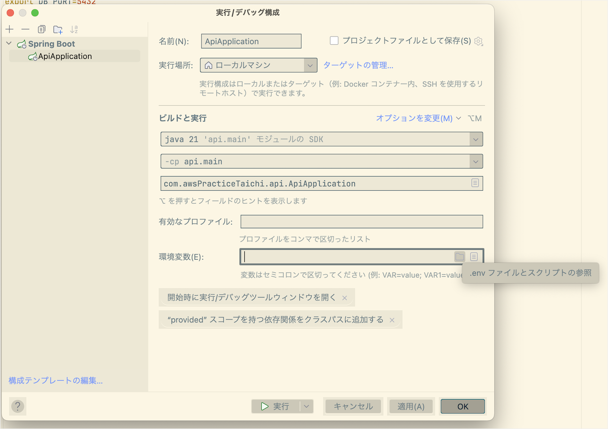

## Spring Bootアプリの起動確認
ここまでの設定がうまくいっているかSpring Bootアプリを起動して確かめましょう。IntelliJの右上のApiApplicationの起動ボタンで起動できます。([DBを立ち上げて](#db_exec)いないと起動失敗します)


コンソールに以下のような表示が出れば起動成功です。

```log
2025-04-28T20:26:31.303+09:00  INFO 9834 --- [api] [           main] c.a.api.ApiApplicationKt                 : Started ApiApplicationKt in 0.953 seconds (process running for 1.137)
```

この状態でブラウザから`localhost:8080`へアクセスしても、ルートのエンドポイントに何も設定していないので404エラーになります。

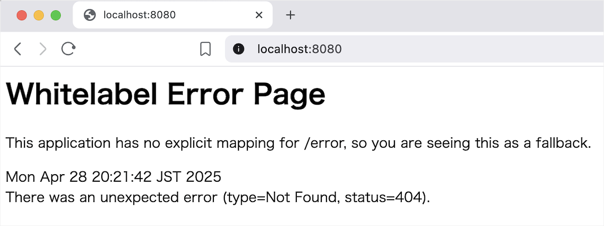

ルートのエンドポイントでDBのデータを返すようにしましょう。

## ルートのエンドポイントでDBのデータを返すようにする
以下4つのファイルを[私のaws-practiceリポジトリ](https://github.com/taichi-web-engineer/aws-practice)と同じパスに配置してください。各ファイルの`package com.awsPracticeTaichi`の部分は[Spring InitializrのProject MetadataのGroup](#spring_initializr_setting)で自身で設定した値に書き換えましょう。

https://github.com/taichi-web-engineer/aws-practice/blob/main/api/src/main/kotlin/com/awsPracticeTaichi/api/presentation/ApiController.kt

https://github.com/taichi-web-engineer/aws-practice/blob/main/api/src/main/kotlin/com/awsPracticeTaichi/api/usecase/ApiUsecase.kt

https://github.com/taichi-web-engineer/aws-practice/blob/main/api/src/main/kotlin/com/awsPracticeTaichi/api/infra/repository/db/AwsTestRepository.kt

https://github.com/taichi-web-engineer/aws-practice/blob/main/api/src/main/kotlin/com/awsPracticeTaichi/api/infra/entity/db/AwsTest.kt

処理の流れをざっと説明すると、
 
 1. `ApiController`でルートのエンドポイントへのアクセスを受ける
 2. `ApiUsecase`で`AwsTestRepository`を使ってDBのデータを取得して`AwsTest`のインスタンスに入れ、`AwsTest.testText`を取得
 3. `ApiController`で取得した`testTest`をListで返す

といった感じ。

## APIでDBデータを取得して返す動作確認
アプリを再起動して`localhost:8080`へアクセスすると、APIがDBから取得したデータを返していることが確認できます。


「プリティ　プリント」という表示は私が使っている[Braveブラウザ](https://brave.com/ja/)が出しているもので、アプリとは無関係です。

## 静的解析ツールdetekt導入
Kotlin、Spring Boot環境では[detekt](https://detekt.dev/)という静的解析ツール(LinterかつFormatter)をよく使います。


detektを導入すると整っていないコードはこのようにハイライトされます。整っていないコードとは、

- 不要なスペース、改行
- importの順番
- 未使用の変数
- マジックナンバー

などです。不要なスペースなどの自動で直せるコードは上記動画のようにショートカットキーで修正することもできます。

detektの導入は公式Docsの`Quick Start with Gradle`にそってやります。

https://detekt.dev/docs/intro#quick-start-with-gradle

といっても`build.gradle.kts`のdetekt設定は[すでに終えている](#latest_build_gradle_kts)ので、`aws-practice/api`のディレクトリで公式Docsの手順通り`gradlew detektGenerateConfig`で`config/detekt/detekt.yml`を生成しましょう。

```bash
cd {path to aws-practice}/api

gradlew detektGenerateConfig
```

`zsh: command not found: gradlew`というエラーが出ます。公式Docsの通りにやるとエラーになる罠ですw

gradlewコマンドの実態は`api/gradlew`にあるシェルスクリプトファイルです。なのでこれを実行するためには`./gradlew detektGenerateConfig`が正しいコマンドになります。コマンドが実行できると`api/config/detekt/detekt.yml`が生成され、detekt設定は完了です。

## IntelliJにdetektプラグインをインストール
ここまでの手順で、コマンドによるdetektの静的解析を実行できるようになりました。ですが、IntelliJでdetektのハイライトを出すためにはdetektプラグインが必要です。IntelliJの設定からdetektプラグインをインストールして適用しましょう。

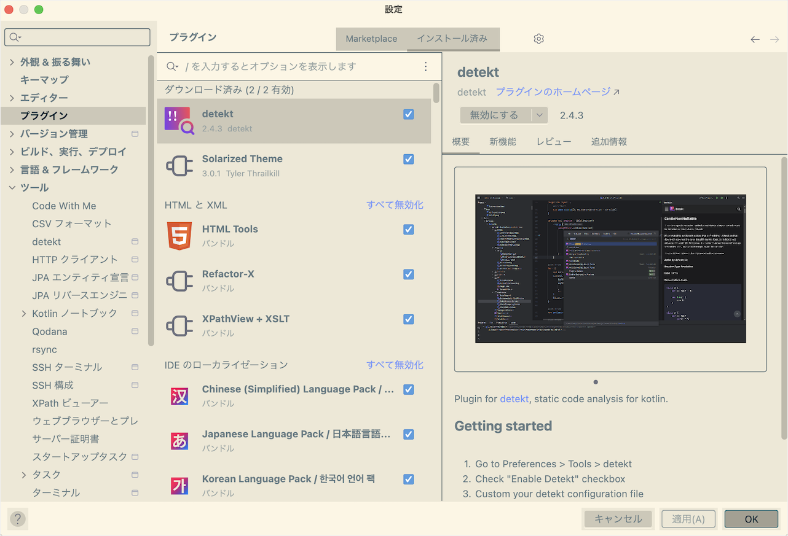

プラグインを適用するとdetektの設定ができるようになります。以下のように設定し、Configuration fileとして`config/detekt/detekt.yml`を追加して適用します。

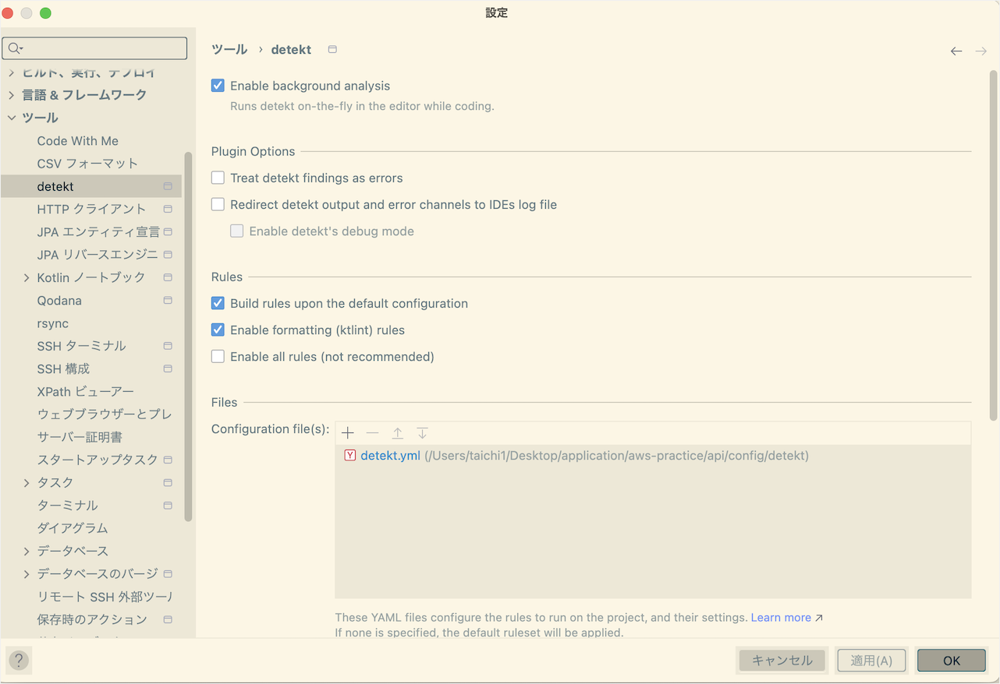

## detektの動作確認
適当なファイルで適当にスペースを入れ、以下のようにdetektのハイライトが出ればOKです。


また、apiディレクトリで`./gradlew detekt`を実行するとプロジェクトの全ファイルを対象にdetektの静的解析が行われます。ですが、今の状態で実行すると`ApiApplication.kt`で`SpreadOperator`というdetektのチェックに引っかかります。

```
> Task :detekt FAILED
/Users/taichi1/Desktop/application/aws-practice/api/src/main/kotlin/com/awsPracticeTaichi/api/ApiApplication.kt:10:35: In most cases using a spread operator causes a full copy of the array to be created before calling a method. This may result in a performance penalty. [SpreadOperator]
```

エラーの概要は「スプレッド演算子(*)は内部的には配列のフルコピーをするのでパフォーマンスに悪影響かもしれないよ」といった感じです。

```kotlin
fun main(args: Array<String>) {
    runApplication<ApiApplication>(*args)
}
```

ただ、スプレッド演算子を使っている上記コードはKotlin、Spring Bootアプリの土台となるもので手を加えることはほぼありません。なので`SpreadOperator`のdetektチェックを無効にしましょう。`detekt.yml`の`SpreadOperator`を`active: false`にします。

```yml
  SpreadOperator:
    active: false
```

ついでに`detekt.yml`の`output-reports:`の部分で

```
スキーマ検証: タイプに互換性がありません。
必須: array。 実際: null.
```

というwarningが出るので、空配列を設定してwarningを回避します。

```yml
  exclude: []
  # - 'TxtOutputReport'
  # - 'XmlOutputReport'
  # - 'HtmlOutputReport'
  # - 'MdOutputReport'
  # - 'SarifOutputReport'
```

そして再度`./gradlew detekt`を実行すると`BUILD SUCCESSFUL`になるはずです。

`./gradlew detekt --auto-correct`を実行すると、プロジェクトの全ファイルをdetektがフォーマットします。適当なktファイルに不要なスペースを入れて保存し、`./gradlew detekt --auto-correct`を実行すれば動作確認ができます。

ファイル単位でのdetekt実行は右クリックで可能です。

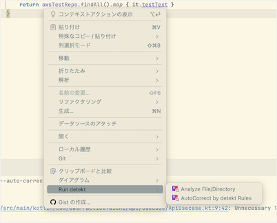

detektのフォーマットはよく使うので、私は`Ctrl + A`のショートカットを割り当てています。

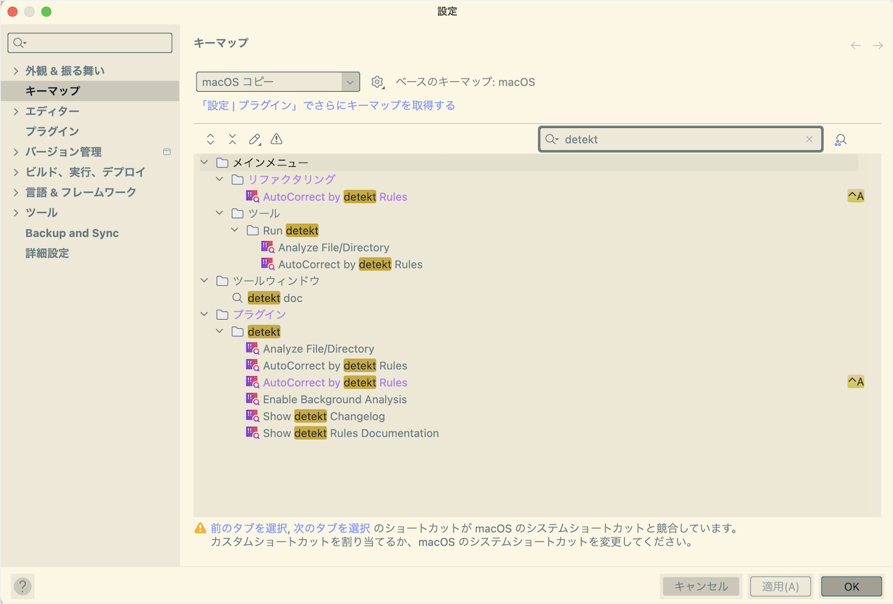

保存時に自動フォーマットが理想ですが、別途プラグインやツールが必要で面倒なため、私はショートカットを使っています。

## detektの静的解析をcommit時に自動実行する
`aws-practice/.githooks/pre-commit`にはcommit時にdetektのチェックおよびフォーマットをかけるスクリプトを書いています。commit時にdetektを実行すれば、フォーマットの整っていないコードがcommitされることはありません。

スクリプトの内容は[detekt公式Docs](https://detekt.dev/docs/gettingstarted/git-pre-commit-hook/)をもとにしています。

https://github.com/taichi-web-engineer/aws-practice/blob/main/.githooks/pre-commit

このスクリプトがcommit時に自動実行されるよう設定をしましょう。

`aws-practice`のディレクトリで`git config core.hooksPath .githooks`を実行し、gitにスクリプトの場所を教えます。次に`chmod +x .githooks/pre-commit`でスクリプトの実行権限を付与して準備完了です。

適当なファイルに不要なスペースを入れてcommitすると、以下のようなエラーになってdetektのフォーマットが実行されます。

```bash
git commit -m "pre-commitテスト"
Running detekt check...

FAILURE: Build failed with an exception.

* What went wrong:
Execution failed for task ':detekt'.
> Analysis failed with 1 weighted issues.

* Try:
> Run with --stacktrace option to get the stack trace.
> Run with --info or --debug option to get more log output.
> Run with --scan to get full insights.
> Get more help at https://help.gradle.org.

BUILD FAILED in 436ms

> Task :detekt FAILED
/Users/taichi1/Desktop/application/aws-practice/api/src/main/kotlin/com/awsPracticeTaichi/api/usecase/ApiUsecase.kt:9:56: Unnecessary long whitespace [NoMultipleSpaces]

1 actionable task: 1 executed
***********************************************
                 detekt failed                 
 Please fix the above issues before committing 
***********************************************
```

## アプリをDockerコンテナ化
AWSのFargateでKotlin、Spring Bootアプリを動かすにはDockerコンテナ化する必要があります。Gensparnkスーパーエージェントで`Dockerfile`を作成しましょう。

「kotlin、springbootアプリケーションをDockerコンテナ化するDockerfileのベストプラクティスを教えてください」というプロンプトでひな型を作成します。
https://www.genspark.ai/agents?id=ce6d61d7-b89a-4f95-9da7-ddf923eeb6d5

そしてAIとのやりとりを踏まえて修正、コメントを追記した完成版`Dockerfile`が以下です。`aws-practice/api/Dockerfile`として配置してください。
https://github.com/taichi-web-engineer/aws-practice/blob/main/api/Dockerfile

## Dockerコンテナでアプリを動かす動作確認
Dockerコンテナで正常にアプリが動くか動作確認をしましょう。まず`aws-practice/api`ディレクトへ移動します。

```bash
cd api
```

OrbStackを起動し、Dockerイメージをビルドします。

```bash
docker build -t aws-practice-api .
```

Dockerでアプリを起動する前に[DBを立ち上げて](#db_exec)おかないと起動が失敗します。DB立ち上げ後、以下コマンドでDockerコンテナを起動しましょう。

```bash
docker run -p 8080:8080 \
  -e DB_HOST=host.docker.internal \
  -e DB_USERNAME=postgres \
  -e DB_PASSWORD=postgres \
aws-practice-api
```

`host.docker.internal`とはホストマシンのIPアドレスに名前解決されます。IntelliJでのアプリ起動時は`DB_HOST=localhost`で環境変数を設定しました。

ですが今回アプリはDockerコンテナで動いているので、`DB_HOST=localhost`とするとアプリのDockerコンテナ自身を参照してDBにつなげません。なのでホストマシンで動いているDBに接続するため、`DB_HOST=host.docker.internal`としてホストマシンに名前解決をしているわけです。

Dockerコンテナ起動後、ブラウザで`localhost:8080`へアクセスするとIntelliJのアプリ起動時と同じ画面が表示されます。


Dockerコンテナのアプリ停止は`Ctrl + C`です。

## Dockerイメージの脆弱性チェック
Dockerイメージに脆弱性があると攻撃される危険があります。[Trivy](https://trivy.dev/latest/)というOSSでイメージの脆弱性チェックをしましょう。

まずTrivyをインストールします。

```bash
brew install trivy
```

`trivy image イメージ名`のコマンドでイメージの脆弱性チェックができます。

```bash
trivy image aws-practice-api
```

以下の表示が出れば脆弱性は0件です。

```bash
Legend:
- '-': Not scanned
- '0': Clean (no security findings detected)
```

## 脆弱性チェックをGithub Actionsで定期実行する
定期的に手動で脆弱性チェックをするのはしんどいです。なのでGithub Actionsでtrivyを週1回0時に定期実行するようにしましょう。

今回もChatGPT o3にやり方を聞きました。

```
プロジェクトのDockerコンテナのTrivyによる脆弱性スキャンをGitHub Actionsで毎週日曜0時に実行したい
```

完成したGithub Actionsのymlファイルが以下です。これを`aws-practice/.github/workflows/trivy-weekly-scan.yml`に配置してコミットします。

https://github.com/taichi-web-engineer/aws-practice/blob/main/.github/workflows/trivy-weekly-scan.yml

これで毎週日曜0時にSpring BootアプリのDockerイメージにtrivyによる脆弱性チェックが実行されます。

手動実行で動作確認もできます。自身のリポジトリのActionsタブ → Weekly Trivy Scan → Run workflowをクリックすれば手動実行可能です。


脆弱性チェックの結果はActionsタブのトップページに表示されます。緑のチェックは脆弱性なし、赤のバツは脆弱性ありです。

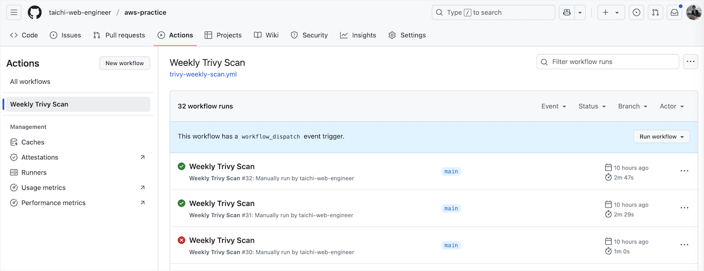

またワークフローの詳細画面からチェック結果詳細をテキストファイルでダウンロードもできます。

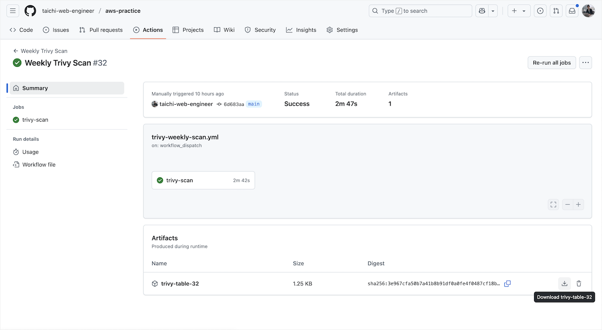

脆弱性ありのときはメールやslack通知を飛ばしたいですが、それは後ほど対応します。

## AWSの環境構築
DB、バックエンドアプリができたのでAWSにアプリを構築していきます。詳細は以下の記事で解説します。

(後日公開予定)