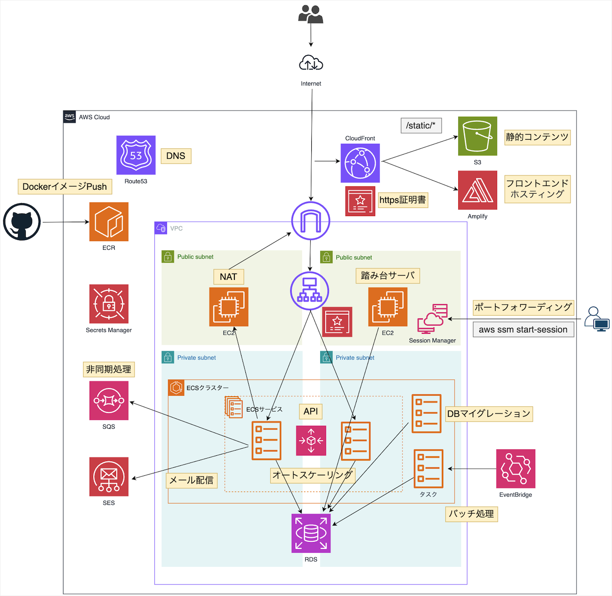
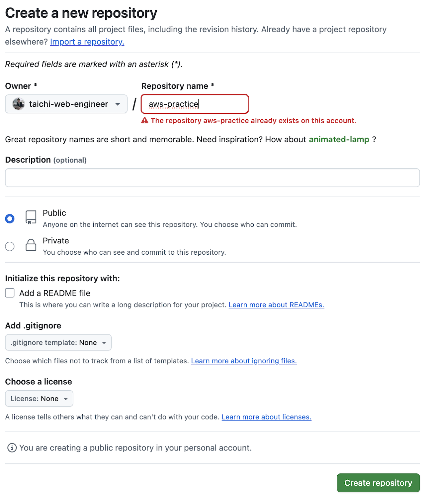

# 現役エンジニアの実務レベルAWS Webアプリ環境構築


本記事のゴールは上記AWS構成のWebアプリを作成することです。技術スタックは
- Kotlin
- Spring Boot
- PostgreSQL
- Go(DBマイグレーションでのみ使用)
- Next.js
- Docker
- Terraform

です。

アプリのバックエンドのGithubリポジトリはこちら。フロントエンドとAWSリソースのTerraformのリポジトリは今後追記します。

https://github.com/taichi-web-engineer/aws-practice

実務レベルのAWS Webアプリ環境構築が目的なので、アプリの機能は最低限しか実装しません。具体的にはKotlin、Spring BootでDBからデータを取得して返すAPIを用意し、Next.jsでAPIから取得したデータを画面表示するのみです。
SQSによる非同期処理、SESによるメール配信も動作確認ができる最低限の機能のみ実装します。

## Gitでaws-practiceリポジトリ作成
自身のGithubでaws-practiceという名前でリポジトリを作成します。



リポジトリを作成したら`git clone`でローカルリポジトリを作成しましょう。
```
git clone git@github.com:taichi-web-engineer/aws-practice.git
```

## グローバルなgitignoreで不要ファイルのcommitを防ぐ
gitでcommitをするとOSの一時ファイルなど、不要なファイルがリポジトリに入ることがあります。

不要ファイルのcommitを防ぐために`~/.config/git/ignore`を作成しましょう。`ignore`に書いたファイルはローカルの全リポジトリでcommit対象外になります。

私のPCはMacOSなので、Githubが出しているMacOS用のgitignoreを使っています。

https://github.com/github/gitignore/blob/main/Global/macOS.gitignore

環境変数の管理は[direnv](https://direnv.net/)というツールでやります（詳細は後ほど解説）。
direnvの環境変数設定ファイルである`.envrc`を`ignore`に追記した完成形の`ignore`が以下です。

```
# General
.DS_Store
.AppleDouble
.LSOverride
Icon[]

# Thumbnails
._*

# Files that might appear in the root of a volume
.DocumentRevisions-V100
.fseventsd
.Spotlight-V100
.TemporaryItems
.Trashes
.VolumeIcon.icns
.com.apple.timemachine.donotpresent

# Directories potentially created on remote AFP share
.AppleDB
.AppleDesktop
Network Trash Folder
Temporary Items
.apdisk

.envrc
```

## aws-practiceリポジトリ用の.gitignoreを作成
aws-practiceリポジトリ用の`.gitignore`を作成します。
ChatGPT o3の検索モードで以下の質問をして`.gitignore`の内容を確認しました。

```
kotlin、spring bootのwebアプリ用の.gitignoreのベストプラクティスを教えて
```

https://chatgpt.com/share/680cc02e-36bc-8009-a7c5-9cdb609d75dd

o3の回答をもとに作成したものが以下です。グローバルなgitignoreで設定しているもの、不要なものは削除しています。

https://github.com/taichi-web-engineer/aws-practice/blob/main/.gitignore

## DB、AWS関連モジュールの取得
私のaws-practiceのGithubリポジトリから`./ops`、`./Makefile`を取得して自身のリポジトリの同じパスに配置してください。DB、AWS環境の構築時に使います。

https://github.com/taichi-web-engineer/aws-practice

## Kotlin、Spring Bootプロジェクトの作成