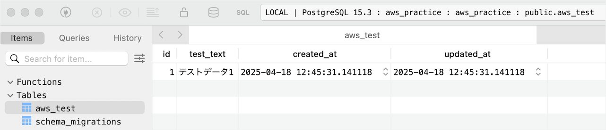
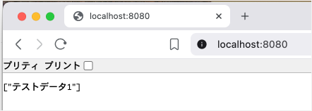
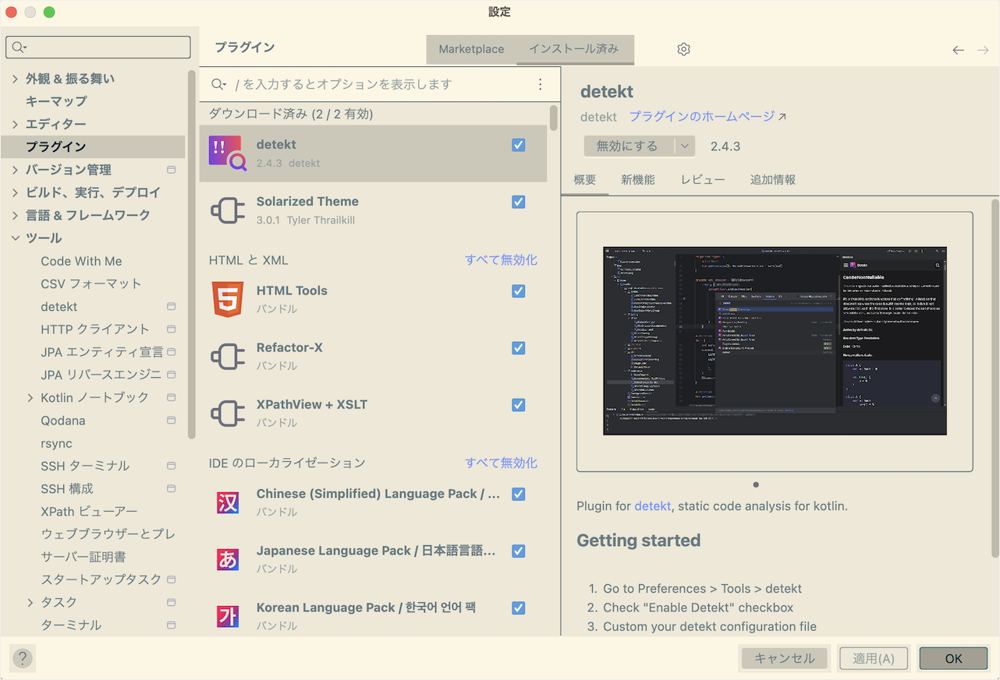
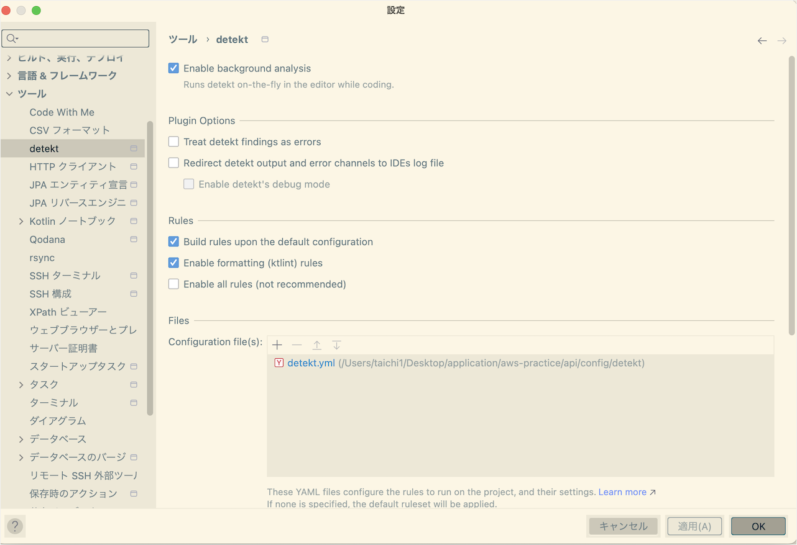
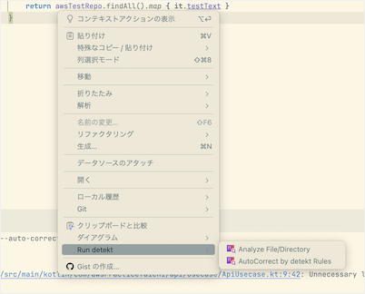

# 現役エンジニアの実務レベルAWS Webアプリ環境構築


本記事のゴールは上記AWS構成のWebアプリを作成することです。技術スタックは

- Kotlin
- Spring Boot
- PostgreSQL
- Go(DBマイグレーションでのみ使用)
- Next.js
- Docker
- Terraform

で、バックエンド開発にはIntelliJ IDEAを使います。

バックエンドのGithubリポジトリは以下です。フロントエンドとAWSリソースのTerraformのリポジトリは今後追記します。

https://github.com/taichi-web-engineer/aws-practice

実務レベルのAWS Webアプリ環境構築が目的なので、アプリの機能は最低限しか実装しません。具体的にはKotlin、Spring BootでDBからデータを取得して返すAPIを用意し、Next.jsでAPIから取得したデータを画面表示するのみです。
SQSによる非同期処理、SESによるメール配信も動作確認ができる最低限の機能のみ実装します。

GitやLinuxコマンドなどの基本は調べればすぐわかるので、説明は割愛します。

## Gitでaws-practiceリポジトリ作成
自身のGithubでaws-practiceという名前でリポジトリを作成します。


リポジトリを作成したら`git clone`でローカルリポジトリを作成しましょう。
```bash
git clone git@github.com:taichi-web-engineer/aws-practice.git
```

## グローバルなgitignoreで不要ファイルのcommitを防ぐ
gitでcommitをするとOSの一時ファイルなど、不要なファイルがリポジトリに入ることがあります。

不要ファイルのcommitを防ぐために`~/.config/git/ignore`を作成しましょう。`ignore`に書いたファイルはローカルの全リポジトリでcommit対象外になります。

私のPCはMacOSなので、Githubが出しているMacOS用のgitignoreを使っています。

https://github.com/github/gitignore/blob/main/Global/macOS.gitignore

環境変数の管理は[direnv](https://direnv.net/)というツールでやります（詳細は後ほど解説）。
direnvの環境変数設定ファイルである`.envrc`を`ignore`に追記した完成形の`ignore`が以下です。

```
# General
.DS_Store
.AppleDouble
.LSOverride
Icon[]

# Thumbnails
._*

# Files that might appear in the root of a volume
.DocumentRevisions-V100
.fseventsd
.Spotlight-V100
.TemporaryItems
.Trashes
.VolumeIcon.icns
.com.apple.timemachine.donotpresent

# Directories potentially created on remote AFP share
.AppleDB
.AppleDesktop
Network Trash Folder
Temporary Items
.apdisk

.envrc
```

## aws-practiceリポジトリの.gitignoreを作成
aws-practiceリポジトリ専用の`.gitignore`を作成します。
ChatGPT o3の検索モードで以下の質問をして`.gitignore`の内容を確認しました。

```
kotlin、spring bootのwebアプリ用の.gitignoreのベストプラクティスを教えて
```

https://chatgpt.com/share/680cc02e-36bc-8009-a7c5-9cdb609d75dd

o3の回答をもとに作成したものが以下です。グローバルなgitignoreで設定しているもの、不要なものは削除しています。

https://github.com/taichi-web-engineer/aws-practice/blob/main/.gitignore

## DB、AWS関連モジュールの取得
私のaws-practiceのGithubリポジトリから`./ops`、`./Makefile`を取得して自身のaws-practiceの同じパスに配置してください。DB、AWS環境の構築時に使います。

https://github.com/taichi-web-engineer/aws-practice

## Kotlin、Spring Bootプロジェクトの作成
[Spring Initializr](https://start.spring.io/#!type=gradle-project-kotlin&language=kotlin&platformVersion=3.4.5&packaging=jar&jvmVersion=21&groupId=com.awsPracticeTaichi&artifactId=api&name=api&description=API%20project%20with%20Spring%20Boot&packageName=com.awsPracticeTaichi.api&dependencies=web,data-jpa,postgresql)で、以下設定でGENERATEボタンをクリックし、Kotlin、Spring Bootプロジェクトをダウンロードしてaws-practiceのルートディレクトリに<span id="spring_initializr_setting">配置</span>します。


`Gradle - Kotlin`を選ぶ理由は私が他のGroovyやMavenを使ったことがないためです。実務でもGradleがよく使われている印象です。

Spring Boot、Javaのバージョンは最新のLTS(安定)バージョンを選びます。

Project Metadataの概要は以下のとおりです。

- Group：ドメインを逆にしたものを設定する。パッケージ名などで使われる
- Artifact：プロジェクト自体のディレクトリ名などで使われる

GroupはAWSで取得するドメインをもとに設定します。私は`aws-practice-taichi.com`というドメインを取得するので、`com.awsPracticeTaichi`としました。パッケージ名で「-」は使えないのでキャメルケースにしています。

DependenciesにはAPI、DB設定に必要なツールを追加しました。

## Kotlin、Spring Bootアプリを最新バージョンにする
Kotlin、Spring Bootなど、各ライブラリのバージョンは`api/build.gradle.kts`で以下のように定義されています。
```kotlin
plugins {
	kotlin("jvm") version "1.9.25"
	kotlin("plugin.spring") version "1.9.25"
	id("org.springframework.boot") version "3.4.5"
	id("io.spring.dependency-management") version "1.1.7"
	kotlin("plugin.jpa") version "1.9.25"
}

group = "com.awsPracticeTaichi"
version = "0.0.1-SNAPSHOT"

java {
	toolchain {
		languageVersion = JavaLanguageVersion.of(21)
	}
}

repositories {
	mavenCentral()
}

dependencies {
	implementation("org.springframework.boot:spring-boot-starter-data-jpa")
	implementation("org.springframework.boot:spring-boot-starter-web")
	implementation("com.fasterxml.jackson.module:jackson-module-kotlin")
	implementation("org.jetbrains.kotlin:kotlin-reflect")
	runtimeOnly("org.postgresql:postgresql")
	testImplementation("org.springframework.boot:spring-boot-starter-test")
	testImplementation("org.jetbrains.kotlin:kotlin-test-junit5")
	testRuntimeOnly("org.junit.platform:junit-platform-launcher")
}

kotlin {
	compilerOptions {
		freeCompilerArgs.addAll("-Xjsr305=strict")
	}
}

allOpen {
	annotation("jakarta.persistence.Entity")
	annotation("jakarta.persistence.MappedSuperclass")
	annotation("jakarta.persistence.Embeddable")
}

tasks.withType<Test> {
	useJUnitPlatform()
}
```

ライブラリのバージョンは最新のLTSを使いたいので、Gensparkのスーパーエージェントに以下のプロンプトで修正してもらいましょう。
```
以下のbuild.gradle.ktsの設定内容を最新のLTSバージョンに更新したいです

{build.gradle.ktsの全文をコピペ}
```

以下がAIとのやりとりの内容です。

https://www.genspark.ai/agents?id=7101cdc5-e583-4460-a838-3dcf928f6c5b

AIの回答を踏まえた<span id="latest_build_gradle_kts">`build.gradle.kts`の最終版</span>は以下です。

https://github.com/taichi-web-engineer/aws-practice/blob/main/api/build.gradle.kts

[detekt](https://detekt.dev/)という静的解析ツールを使いたいので、jvmのバージョン変更や関連ライブラリ追加をしています。(詳細は後ほど解説)

`build.gradle.kts`を更新したら「すべてのGradle プロジェクトを同期」ボタンで`build.gradle.kts`のライブラリやプラグインを反映できます。


Gradle同期時に`The detekt plugin found some problems`という警告が出ますが、これはdetektの設定が未完了なためなので無視してOKです。


## Docker環境構築
Dockerを使うため、[Docker Desktop](https://www.docker.com/ja-jp/products/docker-desktop/)か[OrbStack](https://orbstack.dev/)をインストールします。Appleシリコン製のMacユーザーはOrbStackを圧倒的におすすめします。OrbStackはDocker Desktopと同じ機能で**動作が軽くて速い**からです。詳細は以下の記事を参照してください。

https://qiita.com/shota0616/items/5b5b74d72272627e0f5a

`docker help`コマンドが使えればDocker環境構築完了です。

```bash
docker help

Usage:  docker [OPTIONS] COMMAND

A self-sufficient runtime for containers

Common Commands:
  run         Create and run a new container from an image
  exec        Execute a command in a running container
  ps          List containers
  build       Build an image from a Dockerfile
  pull        Download an image from a registry
  ...
```

## DB環境構築
`ops/db-migrator/README.md`をもとにDB環境構築をします。

https://github.com/taichi-web-engineer/aws-practice/blob/main/ops/db-migrator/README.md

`README.md`に書いてあるとおり`brew install golang-migrate`で`golang-migrate`をインストールします。`golang-migrate`はDBマイグレーションツールで使います。あとは`ops/db-migrator`ディレクトリで以下コマンドを順に実行すればDBにテーブルが作成されます。

```bash
docker compose up -d
go run main.go
```

テーブルを作成したら以下コマンドでテーブルにデータを入れます。

```bash
make restore DB=aws_practice
```

`make restore`コマンドの実態は[ops/db-migrator/Makefile](https://github.com/taichi-web-engineer/aws-practice/blob/9824a750e1d08516d84459d495eaecc733cb1e6d/ops/db-migrator/Makefile#L32)で定義している以下です。

```makefile
# dumpファイルからseedデータを復元する。
# e.g.
# make restore DB=aws_practice
restore: .check-db
	docker compose exec -T db psql -U postgres -d $(DB) -c "DROP SCHEMA public CASCADE; CREATE SCHEMA public;"
	docker compose exec -T db psql -U postgres -d $(DB) < db/$(DB)/dump.sql
```

Makefileとは複数のコマンドや変数を使ってコマンドを簡略化するコマンド集のようなものです。`make restore`コマンドの実態は引数のチェックをしたあと2つの`docker compose exec`コマンドでDBに`dump.sql`のseedデータを登録するコマンドというわけです。

データを入れたら、[TablePlus](https://tableplus.com/)などのDBクライアントツールで`aws_test`テーブルのテストデータを確認できればOKです。



DBのDockerコンテナはマウントによるデータ永続化をしていません。なのでDockerコンテナを停止するとテストデータは削除されます。

永続化をしない理由はDBマイグレーションでDB環境をすぐ復元できるためです。復元のためのテストデータは以下のディレクトリで管理しています。

https://github.com/taichi-web-engineer/aws-practice/tree/main/ops/db-migrator/db/aws_practice

DBを使うときは<span id="db_exec">以下手順</span>でDB環境を復元できます。
 1. Docker Desktop or OrbStackの起動
 2. ops/db-migratorへcd
 3. docker compose up -d
 4. go run main.go
 5. make restore DB=aws_practice

## direnvで環境変数の設定
DBのパスワードなど、Gitにコミットしたくないセキュアな情報は環境変数で管理しましょう。[direnv](https://direnv.net/)というディレクトリごとに環境変数を設定できるツールを使います。

https://zenn.dev/masuda1112/articles/2024-11-29-direnv

direnvをインストールしたら`api`ディレクトリに移動します。

```bash
cd api
```

環境変数を管理するファイルである`.envrc`を作成してエディタで開きます。私はVSCodeを使っています。

```bash
code .envrc
```

`.envrc`に以下を追記して保存しましょう。ローカルのDocker環境のDBなので、接続情報は`ops/db-migrator/compose.yaml`で設定しているデフォルト値を使います。

```
export DB_HOST=localhost
export DB_NAME=aws_practice
export DB_PASSWORD=postgres
export DB_PORT=5432
export DB_USERNAME=postgres
```

`.envrc`を保存したら`direnv allow .`を実行すれば`direnv`で環境変数を使う準備完了です。

## Spring BootアプリのDB接続設定
Spring BootアプリのDB接続情報は`api/src/main/resources/application.properties`で設定します。ただ、`application.properties`よりもyaml形式の`application.yml`の方が階層構造で設定がわかりやすいのでリネームしてください。

リネーム後、`application.yml`に以下の内容をコピペします。

https://github.com/taichi-web-engineer/aws-practice/blob/main/api/src/main/resources/application.yml

`application.yml`の以下の部分で`.envrc`の環境変数を利用しています。

```yml
  datasource:
    url: jdbc:postgresql://${DB_HOST}:${DB_PORT}/${DB_NAME}
    username: ${DB_USERNAME}
    password: ${DB_PASSWORD}
    driver-class-name: org.postgresql.Driver
```

次に、IntelliJで`.envrc`の環境変数を使うために実行/デバッグ構成の環境変数の設定で`.envrc`を選択して適用しましょう。


## Spring Bootアプリの起動確認
ここまでの設定がうまくいっているかSpring Bootアプリを起動して確かめましょう。IntelliJの右上のApiApplicationの起動ボタンで起動できます。([DBを立ち上げて](#db_exec)いないと起動失敗します)


コンソールに以下のような表示が出れば起動成功です。

```log
2025-04-28T20:26:31.303+09:00  INFO 9834 --- [api] [           main] c.a.api.ApiApplicationKt                 : Started ApiApplicationKt in 0.953 seconds (process running for 1.137)
```

この状態でブラウザから`localhost:8080`へアクセスしても、ルートのエンドポイントに何も設定していないので404エラーになります。


ルートのエンドポイントでDBのデータを返すようにしましょう。

## ルートのエンドポイントでDBのデータを返すようにする
以下4つのファイルを[私のaws-practiceリポジトリ](https://github.com/taichi-web-engineer/aws-practice)と同じパスに配置してください。各ファイルの`package com.awsPracticeTaichi`の部分は[Spring InitializrのProject MetadataのGroup](#spring_initializr_setting)で自身で設定した値に書き換えましょう。

https://github.com/taichi-web-engineer/aws-practice/blob/main/api/src/main/kotlin/com/awsPracticeTaichi/api/presentation/ApiController.kt

https://github.com/taichi-web-engineer/aws-practice/blob/main/api/src/main/kotlin/com/awsPracticeTaichi/api/usecase/ApiUsecase.kt

https://github.com/taichi-web-engineer/aws-practice/blob/main/api/src/main/kotlin/com/awsPracticeTaichi/api/infra/repository/db/AwsTestRepository.kt

https://github.com/taichi-web-engineer/aws-practice/blob/main/api/src/main/kotlin/com/awsPracticeTaichi/api/infra/entity/db/AwsTest.kt

処理の流れをざっと説明すると、
 
 1. `ApiController`でルートのエンドポイントへのアクセスを受ける
 2. `ApiUsecase`で`AwsTestRepository`を使ってDBのデータを取得して`AwsTest`のインスタンスに入れ、`AwsTest.testText`を取得
 3. `ApiController`で取得した`testTest`をListで返す

といった感じ。

## APIでDBデータを取得して返す動作確認
アプリを再起動して`localhost:8080`へアクセスすると、APIがDBから取得したデータを返していることが確認できます。



「プリティ　プリント」という表示は私が使っている[Braveブラウザ](https://brave.com/ja/)が出しているもので、アプリとは無関係です。

## 静的解析ツールdetekt導入
Kotlin、Spring Boot環境では[detekt](https://detekt.dev/)という静的解析ツール(LinterかつFormatter)をよく使います。


detektを導入すると整っていないコードはこのようにハイライトされます。整っていないコードとは、

- 不要なスペース、改行
- importの順番
- 未使用の変数
- マジックナンバー

などです。不要なスペースなどの自動で直せるコードは上記動画のようにショートカットキーで修正することもできます。

detektの導入は公式Docsの`Quick Start with Gradle`にそってやります。

https://detekt.dev/docs/intro#quick-start-with-gradle

といっても`build.gradle.kts`のdetekt設定は[すでに終えている](#latest_build_gradle_kts)ので、`aws-practice/api`のディレクトリで公式Docsの手順通り`gradlew detektGenerateConfig`で`config/detekt/detekt.yml`を生成しましょう。

```bash
cd {path to aws-practice}/api

gradlew detektGenerateConfig
```

`zsh: command not found: gradlew`というエラーが出ます。公式Docsの通りにやるとエラーになる罠ですw

gradlewコマンドの実態は`api/gradlew`にあるシェルスクリプトファイルです。なのでこれを実行するためには`./gradlew detektGenerateConfig`が正しいコマンドになります。コマンドが実行できると`api/config/detekt/detekt.yml`が生成され、detekt設定は完了です。

## IntelliJにdetektプラグインをインストール
ここまでの手順で、コマンドによるdetektの静的解析を実行できるようになりました。ですが、IntelliJでdetektのハイライトを出すためにはdetektプラグインが必要です。IntelliJの設定からdetektプラグインをインストールして適用しましょう。



プラグインを適用するとdetektの設定ができるようになります。以下のように設定し、Configuration fileとして`config/detekt/detekt.yml`を追加して適用します。



## detektの動作確認
適当なファイルで適当にスペースを入れ、以下のようにdetektのハイライトが出ればOKです。


また、apiディレクトリで`./gradlew detekt`を実行するとプロジェクトの全ファイルを対象にdetektの静的解析が行われます。ですが、今の状態で実行すると`ApiApplication.kt`で`SpreadOperator`というdetektのチェックに引っかかります。

```
> Task :detekt FAILED
/Users/taichi1/Desktop/application/aws-practice/api/src/main/kotlin/com/awsPracticeTaichi/api/ApiApplication.kt:10:35: In most cases using a spread operator causes a full copy of the array to be created before calling a method. This may result in a performance penalty. [SpreadOperator]
```

エラーの概要は「スプレッド演算子(*)は内部的には配列のフルコピーをするのでパフォーマンスに悪影響かもしれないよ」といった感じです。

```kotlin
fun main(args: Array<String>) {
    runApplication<ApiApplication>(*args)
}
```

ただ、スプレッド演算子を使っている上記コードはKotlin、Spring Bootアプリの土台となるもので手を加えることはほぼありません。なので`SpreadOperator`のdetektチェックを無効にしましょう。`detekt.yml`の`SpreadOperator`を`active: false`にします。

```yml
  SpreadOperator:
    active: false
```

ついでに`detekt.yml`の`output-reports:`の部分で

```
スキーマ検証: タイプに互換性がありません。
必須: array。 実際: null.
```

というwarningが出るので、空配列を設定してwarningを回避します。

```yml
  exclude: []
  # - 'TxtOutputReport'
  # - 'XmlOutputReport'
  # - 'HtmlOutputReport'
  # - 'MdOutputReport'
  # - 'SarifOutputReport'
```

そして再度`./gradlew detekt`を実行すると`BUILD SUCCESSFUL`になるはずです。

`./gradlew detekt --auto-correct`を実行すると、プロジェクトの全ファイルをdetektがフォーマットします。適当なktファイルに不要なスペースを入れて保存し、`./gradlew detekt --auto-correct`を実行すれば動作確認ができます。

ファイル単位でのdetekt実行は右クリックで可能です。



detektのフォーマットはよく使うので、私は`Ctrl + A`のショートカットを割り当てています。


## detektの静的解析をcommit時に自動実行する